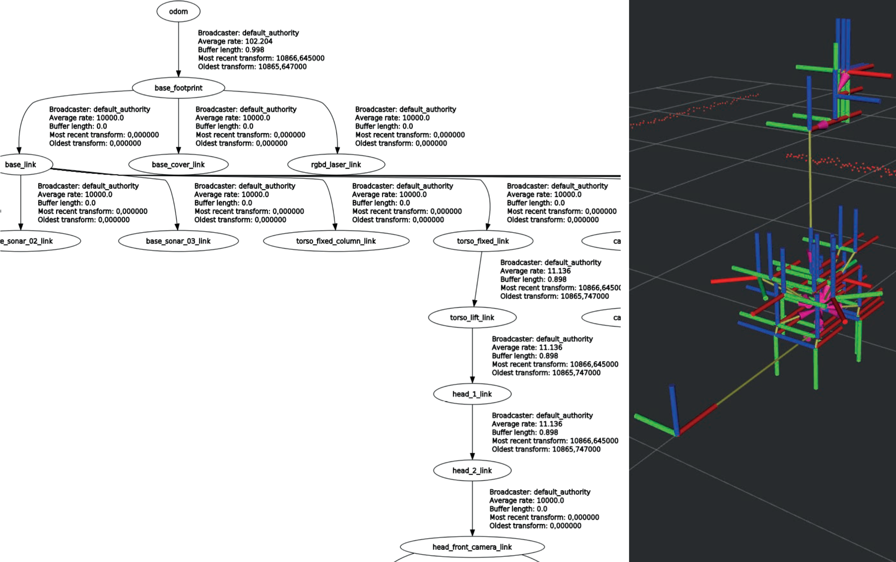
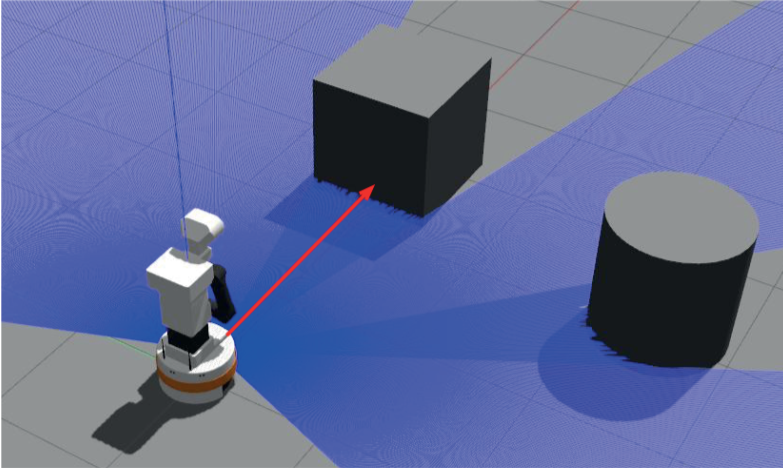
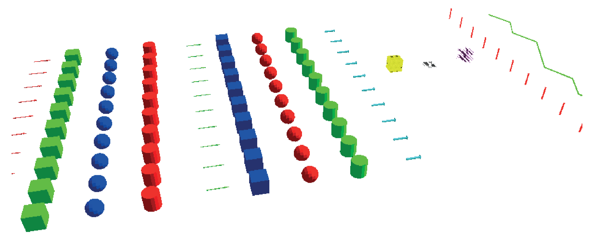
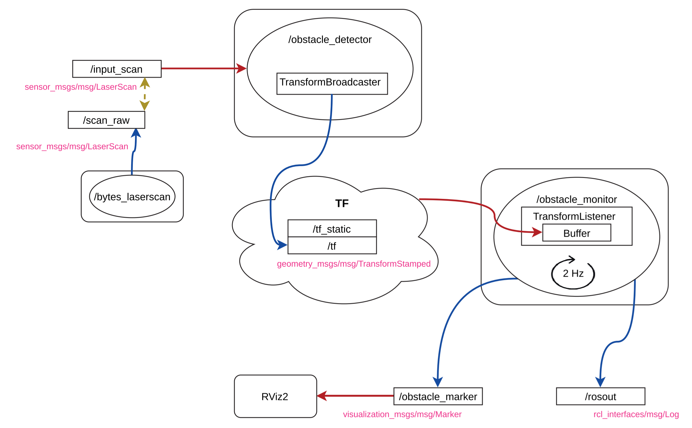
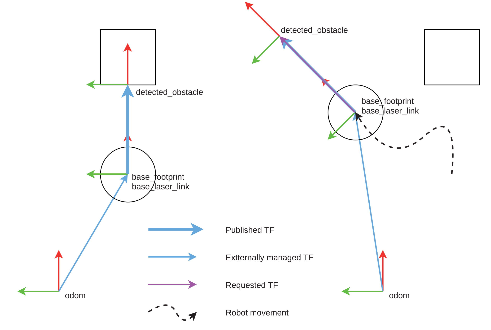
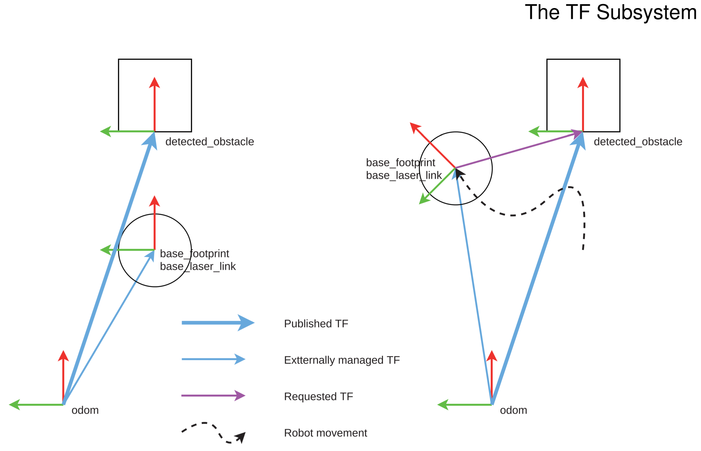

# 第4章-TF子系统

&emsp;&emsp;ROS 最大的隐藏宝藏之一是其 几何变换子系统 TF（简称 TFs）。该子系统允许定义不同的参考轴（也称为坐标系）以及它们之间的几何关系，即使这种关系在不断变化。一个坐标系中的任何坐标都可以重新计算到另一个坐标系中，而无需进行繁琐的手动计算。  
 &emsp;&emsp;根据我教授 ROS 课程的经验，那些不得不在没有 TFs 的情况下处理类似计算的人，在遇到 TFs 时都会表现出极大的惊喜和快乐。  
 &emsp;&emsp;它在 ROS 中的重要性在于需要对机器人的零部件进行几何建模。它在导航、定位和操纵方面有很多应用。它们已被用于定位建筑物中的多个摄像头或动作捕捉系统[↻](https://github.com/MOCAP4ROS2-Project)。  
 &emsp;&emsp;机器人通过安装在机器人身上的传感器感知环境，并执行需要指定空间位置的动作。例如：  

- 距离传感器（激光或 RGBD摄像头）会生成一组点 $(x,y,z)$，用于指示检测到的障碍物。
- 机器人通过指定目标位置$(x,y,z,roll,pitch,yaw)$来移动其末端效应器。
- 机器人移动到地图上的一个点$(x,y,yaw)$。

&emsp;&emsp;所有这些坐标都是对一个坐标系的引用。在机器人中，有多个坐标系（用于传感器、执行器等）。必须知道这些坐标系之间的关系，才能推理出障碍物的坐标，例如，手臂参考轴上的激光检测到的障碍物坐标，从而避开障碍物。坐标系之间的关系是一个坐标系到另一个坐标系的位移和旋转。从代数上讲，这需要使用同质坐标来表示坐标，使用 `RT` 变换矩阵来表示关系。有了一个点 $P$ 在坐标系 $A$ 中的坐标（即 $P_A$），我们就可以利用变换矩阵 $RT_{A→B}$ 计算出坐标系中的 $P_B$，如下所示：

$$
\begin{align*}
P_B=RT_{A→B}*P_A
\end{align*}
$$

$$
\left(\begin{array}{cccc} x_B \\ y_B \\ z_B \\ 1 \\ \end{array}\right) =
\left(\begin{array}{cccc}
R^{xx}_{A→B} & R^{xy}_{A→B} & R^{xz}_{A→B} & T^{x}_{A→B}\\
R^{yx}_{A→B} & R^{yy}_{A→B} & R^{yz}_{A→B} & T^{y}_{A→B}\\
R^{zx}_{A→B} & R^{zy}_{A→B} & R^{zz}_{A→B} & T^{z}_{A→B}\\
0 & 0 & 0 & 1\\ \end{array} \right) *
\left(\begin{array}{cccc} x_A \\ y_A \\ z_A \\ 1 \\ \end{array}\right)
$$

&emsp;&emsp;除了这些操作的复杂性之外，值得注意的是，这些关系在关节型机器人中是高度动态的。如果在高速动态变化的情况下，使用 t + 0.01 秒时的变换对传感器在 t 时刻感知到的点进行变换是错误的。  
 &emsp;&emsp;ROS2 使用两个话题来实现 TF 变换系统（现称为 TF2，第二版），这两个话题接收变换，并将其作为 tf2_msgs/msg/TFMessage 类型的信息；  

```shell
$ ros2 interface show tf2_msgs/msg/TFMessage
geometry_msgs/TransformStamped[] transforms
    std_msgs/Header header
    string child_frame_id
    Transform transform
        Vector3 translation
            float64 x
            float64 y
            float64 z
        Quaternion rotation
            float64 x 0
            float64 y 0
            float64 z 0
            float64 w 1
```

- `/tf` 用于动态变化的变换，如机器人的关节。默认情况下，它们的有效时间很短（10 秒）。例如，由电动关节连接的坐标系关系在此发布。
- `/tf_static` 用于不随时间变化的变换。该话题的 QoS 为 transient_local，因此任何订阅该话题的节点都会收到迄今为止发布的所有变换。通常情况下，在此话题中发布的变换不会随时间而改变，就像机器人的几何形状一样。

&emsp;&emsp;机器人的坐标系以 TF 树的形式组织，每个 TF 最多有一个父节点，可以有多个子节点。如果不是这样，或者几棵树没有连接起来，那么机器人的模型就不完善。按照惯例，有几个重要的轴：

- `/base_footprint` 通常是机器人 TF 的根，对应于机器人在地面上的中心。将来自机器人传感器的信息转换到这个轴上，有助于将它们相互联系起来。
- `/base_link` 通常是 `/base_footprint` 的子坐标系，通常是机器人的中心点，已经高于地面。
- `/odom`是`/base_footprint`的父坐标系，将它们联系起来的变换表示自机器人驱动程序启动以来机器人的位移。

&emsp;&emsp;图 4.1 显示了模拟 Tiago 的部分 TF 树。如需获取，需要安装软件包 ros-foxy-rqt-tf-tree,启动模拟并键入:

```shell
ros2 run rqt_tf_tree rqt_tf_tree
```



&emsp;&emsp;当节点想要使用该系统时，它不会直接订阅这些话题，而是使用 `TFListeners`（TFL 监听器）：

- 要知道在 t 时刻是否有从一坐标系到另一坐标系的 TF。
- 要知道在 t 时刻从坐标系 A 到坐标系 B 的旋转情况。
- 要求在任意时间 t 内将 A 坐标系中的坐标变换到 B 坐标系。

&emsp;&emsp;缓冲区可能不只包含 t 时的 TF，但如果它有一个较早和一个较晚的 TF，它就会执行插值。同样，坐标系 A 和坐标系 B 可能不会直接相连，但中间会有更多坐标系，从而自动执行必要的矩阵运算。  
 &emsp;&emsp;在此不做过多赘述，就目前而言，向 ROS2 节点发布变换非常简单。只需拥有一个变换广播器，并向 TF 系统发送变换即可：

```cpp
geometry_msgs::msg::TransformStamped detection_tf;
detection_tf.header.frame_id = "base_footprint";
detection_tf.header.stamp = now();
detection_tf.child_frame_id = "detected_obstacle";
detection_tf.transform.translation.x = 1.0;
tf_broadcaster_->sendTransform(detection_tf);
```

&emsp;&emsp;获取变换也很简单。有了变换监听器更新的 TF 缓冲区，我们就可以请求从一坐标系到另一坐标系的几何变换。甚至这些坐标系也无需直接连接。任何计算对开发人员来说都是透明的：  

```cpp
tf2_ros::Buffer tfBuffer;
tf2_ros::TransformListener tfListener(tfBuffer);
...
geometry_msgs::msg::TransformStamped odom2obstacle;
odom2obstacle = tfBuffer_.lookupTransform("odom", "detected_obstacle", tf2::TimePointZero);
```

&emsp;&emsp;上述代码会自动计算 `odom → base_footprint → detected_obstacle`。`lookupTransform`（查找变换）的第三个参数表示我们希望从中获取变换的时间点。`tf2::TimePointZero` 表示最新的可用时间点。举例来说，如果我们要对激光器的点进行变换，就应该使用激光器信息标题中的时间戳，因为如果机器人或激光器在那之后发生了移动，那么另一瞬间的变换就不会精确（机器人在几毫秒内就会发生很大变化）。最后，使用 `now()` 询问变换时要小心，因为此时此刻还没有信息，无法推断未来，而且可能会出现异常。  
 &emsp;&emsp;我们可以对变换进行乘法运算或倒数运算。从这里开始，我们将在代码中建立一个术语惯例。这将有助于我们对变换进行操作：

- 如果一个对象表示从 `origin`（坐标系原点）到 `target`（坐标系目标点）的变换，我们称之为 `origin2target`。
- 如果要将两个 TF 相乘，如图 4.2 所示。
    1. 只有当运算符 * 附近的坐标系名相等时，我们才能进行操作。在本例中，坐标系名相等（机器人）。
    2. 结果坐标系 ID 必须是运算符的外部部分（第一个运算符的 odom 和第二个运算符的 object）。
    3. 如果我们反转一个 TF（它们是可反转的），我们就会反转该名称中的坐标系 ID。
    

## 4.1 使用 TF2 的障碍物探测器

&emsp;&emsp;本节将对一个项目进行分析，以了解上述关于 TF 概念的实际应用。  
 &emsp;&emsp;如图 4.3 所示，该项目让机器人使用激光传感器探测前方的障碍物。



&emsp;&emsp;我们将按照许多 ROS2 软件包的常见做法应用 TFs 概念，将感知（perception）作为 TFs 发布。这样做的好处是，即使当前未感知到障碍物，我们也能很容易地从几何角度推理出其在任何坐标系中的位置。
&emsp;&emsp;我们将不引入新的**感知模型**，而是使用前一章中的感知模型：我们将使用激光探测机器人前方的障碍物。使用相同的基于速度的执行模型，尽管在这种情况下我们将手动遥控机器人。



&emsp;&emsp;在本项目中，除了使用有关 TF 的概念外，我们还将展示一种名为 *Visual Markers*[↻](http://wiki.ros.org/rviz/DisplayTypes/Marker) 的强大调试工具，它允许我们发布可在 RViz2 中从节点查看的 3D 可视化元素。通过这种机制，我们可以一目了然地显示机器人的部分内部状态，而不必局限于使用宏 `RCLCPP_*` 生成的调试信息。标记包括箭头、直线、圆柱、球体、线条、形状、文本以及其他任意大小和颜色的标记。图 4.4 显示了可用标记的示例。

## 4.2 计算图

&emsp;&emsp;我们应用程序的计算图（图 4.5）如图 4.5 所示。



&emsp;&emsp;节点在 `scan_raw` 话题中使用了模拟机器人的激光传感器。检测节点订阅激光话题，并在 ROS2 TF 子系统中发布变换。我们的节点订阅了 `/input_scan`，因此必须从 `/scan_raw` 重新映射。  
 &emsp;&emsp;我们将创建一个节点`/obstacle_monitor`，用于读取与检测相对应的变换，并在控制台中显示其相对于机器人总体坐标系（`base_footprint`）的位置。  
 &emsp;&emsp;节点 `/obstacle_monitor` 还会发布视觉标记。在本例中，我们将发布一个红色箭头，将机器人的基座与我们正在发布的障碍物的坐标系位置连接起来。  
 &emsp;&emsp;在本项目中，我们将制作两个版本：一个基本版本和一个改进版本。这样做的目的是为了了解使用 TF 的一个小细节，它对最终结果有重大影响，我们稍后将对此进行说明。

## 4.3 基础探测器

&emsp;&emsp;我们在两个版本中使用相同的软件包。软件包结构见下框：

```txt
<-- Package br2 vff avoidance -->

br2_tf2_detector
├─CMakeLists.txt
├─include
│ └─br2_tf2_detector
│   ├─ObstacleDetectorImprovedNode.hpp
│   ├─ObstacleDetectorNode.hpp
│   └─ObstacleMonitorNode.hpp
├─launch
│ ├─detector_basic.launch.py
│ └─detector_improved.launch.py
├─package.xml
└─src
  ├─br2_tf2_detector 
  │ ├─ObstacleDetectorImprovedNode.cpp
  │ ├─ObstacleDetectorNode.cpp
  │ └─ObstacleMonitorNode.cpp
  ├─publisher.cpp
  └─subscriber_class.cpp
```

&emsp;&emsp;在本节中，我们将忽略名称中包含 `"Improved"`（改进）字样的文件。我们将在下一节看到它们。  
 &emsp;&emsp;读者可以看到软件包结构与前一章相似。节点的声明和定义是分开的，放在名称与软件包一致的目录中。此外，所有内容都将定义在与软件包名称一致的命名空间中。本软件包将在这种结构上向前迈出一小步：现在，我们将把节点编译为一个动态库，并与可执行文件链接。 也许在本项目中我们不会注意到这种区别，但这样可以节省空间，也更方便，还可以将其导出到其他软件包中（现在还不是这样）。库的名称将是软件包的名称（`${PROJECT_NAME}`），就像在软件包中创建支持库时一样。让我们看看在 `CMakeLists.txt` 文件中是什么样子的：  

 ```js
<!-- CMakeLists.txt -->
project(br2_tf2_detector)
find_package(...)
...
set(dependencies
...
)

include_directories(include)

add_library(${PROJECT_NAME} SHARED
  src/br2_tf2_detector/ObstacleDetectorNode.cpp
  src/br2_tf2_detector/ObstacleMonitorNode.cpp
  src/br2_tf2_detector/ObstacleDetectorImprovedNode.cpp
)
ament_target_dependencies(${PROJECT_NAME} ${dependencies})

add_executable(detector src/detector_main.cpp)
ament_target_dependencies(detector ${dependencies})
target_link_libraries(detector ${PROJECT_NAME})

add_executable(detector_improved src/detector_improved_main.cpp)
ament_target_dependencies(detector_improved ${dependencies})
target_link_libraries(detector_improved ${PROJECT_NAME})

install(TARGETS
  ${PROJECT_NAME}
  detector
  detector_improved
  ARCHIVE DESTINATION lib
  LIBRARY DESTINATION lib
  RUNTIME DESTINATION lib/${PROJECT_NAME}
)
```

&emsp;&emsp;请注意，现在需要添加`target_link_libraries`，并将该库安装在与可执行文件相同的位置。在指定每个可执行文件的文件时，不再需要指定主 `cpp` 程序文件以外的文件。

### 4.3.1 分析障碍物检测器节点

&emsp;&emsp;它的执行遵循面向事件的模型，而不是迭代模型。节点收到的每条信息都会产生输出，因此节点的逻辑位于激光回调中是合理的。

```cpp
//<-- include/br2_tf2_detector/ObstacleDetectorNode.hpp -->
class ObstacleDetectorNode : public rclcpp::Node
{
public:
  ObstacleDetectorNode();

private:
  void scan_callback(sensor_msgs::msg::LaserScan::UniquePtr msg);

  rclcpp::Subscription<sensor_msgs::msg::LaserScan>::SharedPtr scan_sub_;
  std::shared_ptr<tf2_ros::StaticTransformBroadcaster> tf_broadcaster_;
};
```

&emsp;&emsp;由于节点必须向 TF 子系统发布变换，因此我们声明了一个静态变换广播器（`StaticTransformBroadcaster`），发布在 `/tf_static` 中。我们也可以声明一个 `TransformBroadcaster`，在 `/tf` 发布。除了耐久性 QoS 外，两者的区别在于我们希望变换能在非静态变换默认的 10 秒后继续存在。  
 &emsp;&emsp;我们为 `tf_broadcaster_`使用了 `shared_ptr`，因为它的构造函数需要一个 `rclcpp::Node∗` ，而我们在进入构造函数后才会得到它（事实上，一些 C++ 开发人员建议避免在构造函数中使用这种方法，因为在构造函数结束之前，对象还没有完全初始化。）：

```cpp
//<-- src/br2_tf2_detector/ObstacleDetectorNode.cpp -->
ObstacleDetectorNode::ObstacleDetectorNode()
: Node("obstacle_detector")
{
  scan_sub_ = create_subscription<sensor_msgs::msg::LaserScan>(
    "input_scan", rclcpp::SensorDataQoS(),
    std::bind(&ObstacleDetectorNode::scan_callback, this, _1));

  tf_broadcaster_ = std::make_shared<tf2_ros::StaticTransformBroadcaster>(*this);
}
```

&emsp;&emsp;`tf_broadcaster` 对象负责管理静态 TF 的发布。TF 的消息类型是 `geometry_msgs/msg/TransformStamped`。让我们看看它是如何使用的：

```cpp
//<-- src/br2_tf2_detector/ObstacleDetectorNode.cpp -->
void
ObstacleDetectorNode::scan_callback(sensor_msgs::msg::LaserScan::UniquePtr msg)
{
  double dist = msg->ranges[msg->ranges.size() / 2];

  if (!std::isinf(dist)) {
    geometry_msgs::msg::TransformStamped detection_tf;

    detection_tf.header = msg->header;
    detection_tf.child_frame_id = "detected_obstacle";
    detection_tf.transform.translation.x = msg->ranges[msg->ranges.size() / 2];

    tf_broadcaster_->sendTransform(detection_tf);
  }
}
```

- 输出信息的标题将是输入激光信息的标题。我们这样做是因为时间戳必须是感测读数的时间。如果我们使用 `now()`，根据信息的延迟和计算机的负载情况，转换将不会精确，而且可能会出现同步错误。
- `frame_id` 是转换的源坐标系（或父坐标系），已包含在此标头中。在本例中，它是传感器坐标系，因为物体的感知坐标位于该坐标系中。
- `child_frame_id`（子坐标系 ID）字段是我们要创建的新坐标系的 ID，代表感知到的障碍物。
- 变换字段包含一个平移和一个旋转，按此顺序从父坐标系应用到我们要创建的子坐标系。由于激光坐标系的 X 轴与我们正在测量的激光束对齐，因此 X 轴的平移就是读取的距离。  
旋转是指应用平移后坐标系的旋转。由于该值在这里无关紧要（检测是一个点），我们使用信息构造函数设置的默认四元数值（0, 0, 0, 1）。
- 最后，使用 `tf_broadcaster_` 的 `sendTransform()` 方法将变换发送到 TF 子系统。

### 4.3.2 障碍物监测节点

&emsp;&emsp;`/obstacle_monitor` 节点会从 TFs 系统中提取检测到的对象的变换，并通过两种方式向用户显示：

- 控制台上的标准输出会随时显示障碍物相对于机器人的位置，即使它不再被检测到。
- 使用可视标记，特别是箭头，从机器人开始指向检测到的障碍物。

分析标题，看看这个节点有哪些元素：

```cpp
// <-- include/br2_tf2_detector/ObstacleMonitorNode.hpp -->
class ObstacleMonitorNode : public rclcpp::Node
{
public:
  ObstacleMonitorNode();

private:
  void control_cycle();
  rclcpp::TimerBase::SharedPtr timer_;

  tf2::BufferCore tf_buffer_;
  tf2_ros::TransformListener tf_listener_;

  rclcpp::Publisher<visualization_msgs::msg::Marker>::SharedPtr marker_pub_;
};
```

- 该节点的执行模型是迭代式的，因此我们声明了 `timer_` 及其回调 `control_cycle`。
- 要访问 TF 系统，可以使用 `tf2_ros::TransformListener` 更新缓冲区 `tf_buffer_`，我们可以对其进行所需的查询。
- 我们只需要一个可视标记发布器。

&emsp;&emsp;在类定义中，我们暂时忽略了视觉标记的部分，只显示与 TF 相关的部分。

```cpp
// <-- src/br2_tf2_detector/ObstacleMonitorNode.cpp -->
ObstacleMonitorNode::ObstacleMonitorNode()
: Node("obstacle_monitor"),
  tf_buffer_(),
  tf_listener_(tf_buffer_)
{
  marker_pub_ = create_publisher<visualization_msgs::msg::Marker>("obstacle_marker", 1);

  timer_ = create_wall_timer(
    500ms, std::bind(&ObstacleMonitorNode::control_cycle, this));
}

void
ObstacleMonitorNode::control_cycle()
{
  geometry_msgs::msg::TransformStamped robot2obstacle;

  try {
    robot2obstacle = tf_buffer_.lookupTransform(
      "base_footprint", "detected_obstacle", tf2::TimePointZero);
  } catch (tf2::TransformException & ex) {
    RCLCPP_WARN(get_logger(), "Obstacle transform not found: %s", ex.what());
    return;
  }

  double x = robot2obstacle.transform.translation.x;
  double y = robot2obstacle.transform.translation.y;
  double z = robot2obstacle.transform.translation.z;
  double theta = atan2(y, x);

  RCLCPP_INFO(
    get_logger(), "Obstacle detected at (%lf m, %lf m, , %lf m) = %lf rads",
    x, y, z, theta);
}
```

- 请注意 `tf_listener_` 是如何初始化的，它只是指定了要更新的缓冲区。稍后，将直接对缓冲区进行查询。
- 我们注意到，控制环以 2 Hz 的速度运行，并通过 `RCLCPP_INFO` 向我们显示信息（到 `/ros_out` 和 stdout）。
- 最相关的函数是 `lookupTransform`，它可以计算从一坐标系到另一坐标系的几何变换，即使没有直接关系。我们可以指定一个特定的时间戳，或者通过指示 `tf2::TimePointZero` 来指定最后一个可用的时间戳。如果时间戳不存在，或者我们需要在未来对时间戳进行转换，该调用可能会引发异常，因此应使用 `try/catch` 来处理可能出现的错误。
- 请注意，我们在 `ObstacleDetectorNode` 中发布的 TF 是`base_laser_link` → `detected_obstacle`，而现在我们要求的是 `base_footprint` → `detected_obstacle`。由于机器人的建模非常完善，`base_laser_link` 和 `base_footprint` 之间的几何关系也可以计算出来，因此 `lookupTransform` 返回正确的信息是没有问题的。

&emsp;&emsp;让我们来看看与生成视觉标记相关的部分。我们的目标是在屏幕上向机器人显示障碍物的坐标，并在 RViz2 中显示一个几何图形，以便我们以可视方式调试程序。在本例中，这将是一个从机器人到障碍物的红色箭头。为此，请创建一个 `visualization_msgs/msg/Marker` 消息，并填写其中的字段以获得该箭头：

```cpp
// <-- src/br2_tf2_detector/ObstacleMonitorNode.cpp -->
  visualization_msgs::msg::Marker obstacle_arrow;
  obstacle_arrow.header.frame_id = "base_footprint";
  obstacle_arrow.header.stamp = now();
  obstacle_arrow.type = visualization_msgs::msg::Marker::ARROW;
  obstacle_arrow.action = visualization_msgs::msg::Marker::ADD;
  obstacle_arrow.lifetime = rclcpp::Duration(1s);

  geometry_msgs::msg::Point start;
  start.x = 0.0;
  start.y = 0.0;
  start.z = 0.0;
  geometry_msgs::msg::Point end;
  end.x = x;
  end.y = y;
  end.z = z;
  obstacle_arrow.points = {start, end};

  obstacle_arrow.color.r = 1.0;
  obstacle_arrow.color.g = 0.0;
  obstacle_arrow.color.b = 0.0;
  obstacle_arrow.color.a = 1.0;

  obstacle_arrow.scale.x = 0.02;
  obstacle_arrow.scale.y = 0.1;
  obstacle_arrow.scale.z = 0.1;
```

&emsp;&emsp;在可视化标记参考文档[↻](http://wiki.ros.org/rviz/DisplayTypes/Marker)中，记录了每种标记类型的每个字段的含义。在箭头的情况下，点字段将填入与检测相对应的起点（0, 0, 0）和终点（均为`base_footprint`）。不要忘记指定颜色，尤其是 `alpha` 值，因为如果默认值为 0，我们将看不到任何东西。

### 4.3.3 运行基础探测器

&emsp;&emsp;我们在同一个进程中实例化这两个节点，并使用单线程执行器（`SingleThreadedExecutor`）进行测试。这样就足够同时运行两个进程了：

```cpp
// <-- src/br2_tf2_detector/src/detector_main.cpp -->
int main(int argc, char * argv[]){
  rclcpp::init(argc, argv);

  auto obstacle_detector = std::make_shared<br2_tf2_detector::ObstacleDetectorNode>();
  auto obstacle_monitor = std::make_shared<br2_tf2_detector::ObstacleMonitorNode>();

  rclcpp::executors::SingleThreadedExecutor executor;
  executor.add_node(obstacle_detector->get_node_base_interface());
  executor.add_node(obstacle_monitor->get_node_base_interface());

  executor.spin();

  rclcpp::shutdown();
  return 0;
}
```

按照接下来的命令测试我们的节点：  

```shell
# 终端 1: Tiago模拟
$ ros2 launch br2_tiago sim.launch.py world:=empty
```

```shell
# 终端 2: 启动节点
$ ros2 launch br2_tf2_detector detector_basic.launch.py
```

```shell
# 终端 3：键盘遥控操作
$ ros2 run teleop_twist_keyboard teleop_twist_keyboard --ros-args -r
cmd vel:=/key vel
```

```shell
# 终端 4: RViz2
$ ros2 run rviz2 rviz2 --ros-args -p use_sim_time:=true
```

&emsp;&emsp;在 Gazebo 中，在机器人前方添加一个障碍物。开始在终端中查看检测信息。在 Rviz2 中，将固定坐标系更改为 `odom`。在 RViz2 中添加标记显示，指定为我们为了发布视觉标记而创建的话题。如果尚未添加 TF 显示，也请添加。图 4.6 显示了障碍物的 TF 和红色箭头。


&emsp;&emsp;做一个快速练习：使用遥控操作器，将机器人向前并向一侧移动，使其不再感知到障碍物。继续移动机器人，发现 `lookupTransform` 返回的信息不再正确。它继续显示障碍物在前方，但事实已不再如此。到底发生了什么？我们可能希望箭头指向障碍物的位置，但现在箭头随着机器人的移动而固定不动了。  
 &emsp;&emsp;让我们用图 4.7 来解释一下。只要机器人感知到障碍物，所要求的变换（粉红色箭头）就是正确的。这是从机器人的激光到障碍物的变换。当我们因为障碍物消失而停止更新变换（蓝色粗箭头）时，变换仍然存在。如果我们移动机器人，`lookupTransform` 会一直返回最后一个有效变换：在机器人前方。这使得视觉标记也出现了错误。下文将介绍一种解决这种不良情况的策略。



## 4.4 改进后的探测器

&emsp;&emsp;解决方法是在不受机器人运动影响的固定坐标系中发布检测 TF，例如 `odom`（如果机器人正在导航，则为 `mao`）。如果我们这样做，当我们需要进行 `base_footprint → detected_obstacle`（粉色箭头）变换时，这个变换的计算将考虑到机器人的移动，并收集到 `odom → base_footprint` 变换中。如图 4.8 所示，障碍物检测器改进节点（`ObstacleDetectorImprovedNode`）是对障碍物检测器节点（`ObstacleDetectorNode`）的修改，以实现这一改进。这个新节点使用 TF 进行操作，因此在某些时候，它会参考现有 TF 的值。因此，除了拥有一个静态变换发布器（`StaticTransformPublisher`）外，它还实例化了一个变换监听器（`TransformListener`）及其相关的缓冲器（`Buffer`）。



```cpp
// <-- include/br2_tf2_detector/ObstacleMonitorNode.hpp -->
class ObstacleDetectorImprovedNode : public rclcpp::Node {
...
private:
    ...
    tf2::BufferCore tf_buffer_; tf2_ros::TransformListener tf_listener_;
};
```

&emsp;&emsp;让我们来实现这个节点。在这个程序中，请查看两个相关但不相同的数据结构：

- `geometry_msgs::msg::TransformStamped` 是一种消息类型，用于发布 TF，是 `lookupTransform` 返回的结果。计算出的 TF（蓝色粗箭头）考虑了机器人的位移。
- `tf2::Transform` 是 TF2 库的一种数据类型，可用于执行操作。
- `tf2::Stamped<tf2::Transform>`与前一个类似，但有一个表示时间戳的标头。有必要遵守
类型。
- `tf2::fromMsg/tf2::toMsg` 是转换函数，可以将消息类型转换为 TF2 类型，反之亦然。

&emsp;&emsp;一般来说，不要在节点内使用消息类型对其进行操作。这一建议适用于 TF、图像、点云和更多数据类型。消息对节点通信很有帮助，但功能非常有限。如果有提供本地类型的库，请使用它，因为它会更有用。通常，有一些函数可以从消息类型传递到本地类型。在本例中，我们使用 `geometry_msgs::msg::TransformStamped` 发送和接收 TF，但使用 TF2 库对其进行操作。  
 &emsp;&emsp;考虑到之前建立的惯例，让我们看看如何进行改进。如前所述，我们的目标是创建 TF `odom2object`（对象是检测到的障碍物）。观察结果用 `laser2object` 的变换表示，因此我们必须在下面的等式中找到 $X$：

$$
odom2object = X*laser2object
$$

 &emsp;&emsp;根据上述规则推导，$X$ 必须是 `odom2laser`，这是一个可以通过 `lookupTransform` 请求的 TF。

```cpp
// <-- src/br2_tf2_detector/ObstacleDetectorImprovedNode.cpp -->
  double dist = msg->ranges[msg->ranges.size() / 2];

  if (!std::isinf(dist)) {
    tf2::Transform laser2object;
    laser2object.setOrigin(tf2::Vector3(dist, 0.0, 0.0));
    laser2object.setRotation(tf2::Quaternion(0.0, 0.0, 0.0, 1.0));

    geometry_msgs::msg::TransformStamped odom2laser_msg;
    tf2::Stamped<tf2::Transform> odom2laser;
    try {
      odom2laser_msg = tf_buffer_.lookupTransform(
        "odom", "base_laser_link",
        tf2::timeFromSec(rclcpp::Time(msg->header.stamp).seconds() - 0.3));
      tf2::fromMsg(odom2laser_msg, odom2laser);
    } catch (tf2::TransformException & ex) {
      RCLCPP_WARN(get_logger(), "Obstacle transform not found: %s", ex.what());
      return;
    }

    tf2::Transform odom2object = odom2laser * laser2object;

    geometry_msgs::msg::TransformStamped odom2object_msg;
    odom2object_msg.transform = tf2::toMsg(odom2object);

    odom2object_msg.header.stamp = msg->header.stamp;
    odom2object_msg.header.frame_id = "odom";
    odom2object_msg.child_frame_id = "detected_obstacle";

    tf_broadcaster_->sendTransform(odom2object_msg);
  }
```

- `laser2object` 存储的是对检测到的物体的感知。这只是与障碍物距离相对应的 X 轴平移。
- 要获得 `odom2laser`，我们需要使用 `lookupTransform` 查询 TF 子系统，将得到的变换信息转换为所需类型，以便使用变换进行操作。
- 至此，我们已经具备了计算 `odom2object`（即相对于固定坐标系 `odom` 的障碍物位置）的一切条件。
- 最后，我们将输出信息合成并发布到 TF 子系统。由于 TF 系统知道 `odom → base_footprint 和 odom → obstacle` 这两个 TF，因此无需对 `ObstacleMonitorNode` 做任何更改，因为 `lookupTransform` 会计算 TF `base_footprint → obstacle`。

### 4.4.1 运行改进后的探测器

&emsp;&emsp;节点的执行过程与基本情况类似。在这种情况下，主程序和启动器与基本情况下的类似，只是有了新的改进节点，所以我们在这里就不展示了。让我们按照类似的命令来执行它：

```shell
# 终端 1: Tiago模拟
$ ros2 launch br2_tiago sim.launch.py world:=empty
```

```shell
# 终端 2: 启动节点
$ ros2 launch br2_tf2_detector detector_improved.launch.py
```

```shell
# 终端 3：键盘遥控操作
$ ros2 run teleop_twist_keyboard teleop_twist_keyboard --ros-args -r
cmd vel:=/key vel
```

```shell
# 终端 4: RViz2
$ ros2 run rviz2 rviz2 --ros-args -p use_sim_time:=true
```

&emsp;&emsp;在 Gazebo 中添加障碍物，以便机器人可以检测到它。在 RViz2 中观察控制台输出和可视标记。移动机器人，使其无法检测到障碍物，看看现在的标记和输出是如何正确的。位移编码为 `odom → base_footprint` 变换，用于正确更新信息。

## 建议练习

1. 制作一个节点，每秒显示机器人移动了多少。可以通过保存 $(odom → base_footprint)_t$，然后从 $(odom → base_footprint)_{t+1}$ 中减去它来实现
2. 在障碍物检测器节点（`ObstacleDetectorNode`）中，根据与障碍物的距离改变箭头的颜色：绿色代表远，红色代表近。 
3. 在障碍物检测器节点中，在终端显示障碍物在 `odom` 坐标系、`base_footprint` 和 `head_2_link` 中的位置。
