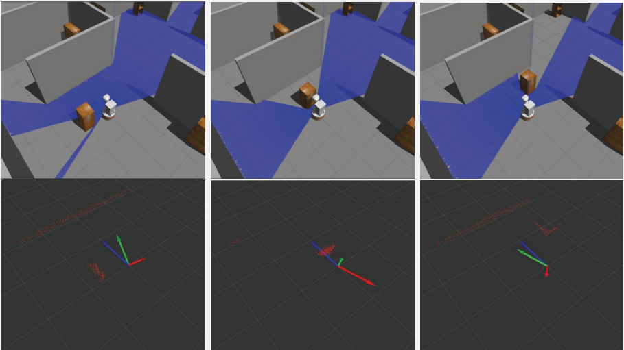
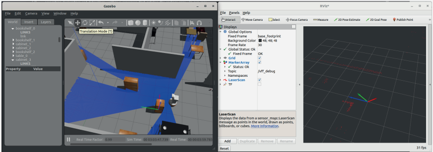
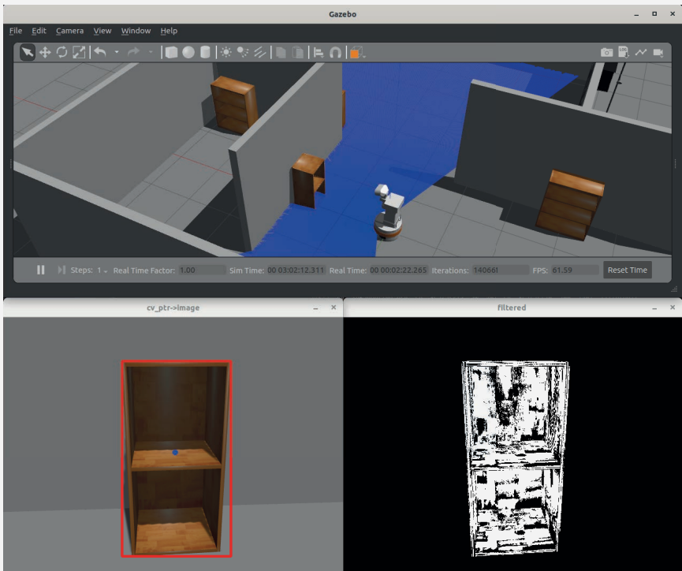

# 第5章-反应行为

&emsp;&emsp;“反应行为”将感知与行动紧密耦合，无需使用介入的抽象表示。正如布鲁克斯在他的“subsumption(取代)架构[^1]”中所演示的，可以通过由高层激活或抑制的简单反应行为创建相对复杂的行为。  
&emsp;&emsp;在本章中，我们不会讨论subsumption架构的开发。顺便说一句，读者可以参考Cascade Lifecycle[↻](https://github.com/fmrico/cascade_lifecycle)包和rqt_cascade_hfsm[↻](https://github.com/fmrico/rqt_cascade_hfsm)，这些提供了构建subsumption架构的一些构建块。本章的目标是展示一些使用不同资源的反应性行为，以深化对ROS2的了解。  
&emsp;&emsp;本章首先将介绍一个简单的局部导航算法——虚拟力场（VFF），该算法使用激光避开障碍物。这个例子将建立一些关于视觉标记的知识，并介绍一些测试驱动开发的方法论。  
&emsp;&emsp;其次，我们将看到基于摄像头信息的反应式跟踪行为。我们将了解如何处理图像以及如何控制机器人的关节。此外，我们还将了解一种有利的节点类型，称为生命周期节点。  

## 5.1 用VFF避障

&emsp;&emsp;这一部分将展示如何实现一个简单的反应行为，使`Tiago`机器人向前移动时通过一个简单的VFF算法避开障碍物。这个简单算法基于使用三个二维向量来计算控制速度:

- **吸引向量** : 这个向量总是指向前方，因为在没有障碍物的情况下，机器人希望沿直线移动。
- **排斥向量** : 此向量是根据激光传感器的读数计算得出的。在我们的基础版本中，距离机器人最近的障碍物会产生一个排斥向量，该向量与其距离成反比。
- **结果向量** : 这个向量是前两个向量的和，将用于计算控制速度。线速度取决于结果向量的模长，转角取决于结果向量的角度。

&emsp;&emsp;图5.1展示了基于障碍物位置的这些向量的示例。


## 5.1.1 计算图

&emsp;&emsp;首先，看看这个问题的计算图是什么样子的。如图5.2所示，我们在一个进程中有一个单独的节点，具有以下元素和特性:  

- 该节点订阅了一个包含感知信息的消息主题，并将其发布到一个速度消息主题。这些将是主要的输入和输出。正如上一章中讨论的，我们将使用这些主题的通用名称，这些名称将在部署时被重新映射。
- 拥有足够的信息来确定一个机器人为什么以特定方式行动是至关重要的。ROS2提供了许多调试工具。使用`/rosout`是一个不错的选择。利用机器人上装备的LED灯也很方便。通过一个可以变颜色的LED，我们已经可以用颜色编码来表示机器人的状态或感知。一眼就能获取很多关于机器人为什么做出其决策的信息。
- 在这种情况下，除了上述输入和输出主题之外，我们还增加了调试主题`/vff_debug`，该主题发布视觉标记以可视化VFF的不同向量。图5.1中的彩色向量是由节点发布并在RViz2中可视化的视觉标记。


- 在这种情况下，我们将选择一个由节点内部通过定时器控制的迭代执行方式，以每秒20次的频率运行控制逻辑

## 5.1.2 包结构

&emsp;&emsp;看到包的组织结构，在下一个框中，已经是我们包中的标准了：每个节点都有其声明和在其`.hpp`和`.cpp`中的不同定义，以及将实例化它的主程序。我们有一个启动目录，里面有一个启动器，可以轻松执行我们的项目。请注意，我们现在增加了一个测试目录，在这个目录中，我们将有我们的测试文件，我们稍后会进行解释。  

```txt
<-- Package br2 vff avoidance -->

br2_vff_avoidance
├─CMakeLists.txt
├─include
│ └─br2_vff_avoidance
|   └─AvoidanceNode.hpp
├─launch
| └─aviodance_vff.launch.py
├─package.xml
├─src
| ├─aviodance_vff_main.cpp
| └─br2_vff_avoidance
|   └─AvoidanceNode.cpp
└─tests
  ├─CMakeLists.txt
  └─vff_test.cpp
```

## 5.1.3 控制逻辑

&emsp;&emsp;AvoidanceNode（高级避障节点）实现了VFF算法，根据激光读数生成控制命令。主要元素与之前的例子相似：  

- 一个用于激光读数的订阅者，其功能是更新 `last_scan_` 中的最新读数。
- 一个用于速度的发布者。
- 一个用于计算VFF算法基础上的三个向量的 `get_vff` 函数，给定来自激光的读数。我们声明了一个新类型 `VFFVectors` 来打包这些向量。
- 由于该节点是迭代执行的，我们使用一个计时器并使用方法`control_cycle`作为回调函数。

```cpp
<-- include/br2 vff avoidance/AvoidanceNode.hpp -->

struct VFFVectors
{
    std::vector<float> attractive;
    std::vector<float> repulsive;
    std::vector<float> result;
};
class AvoidanceNode : public rclcpp::Node
{
    public:
        AvoidanceNode();
        void scan_callback(sensor_msgs::msg::LaserScan::UniquePtr msg);
        void control_cycle();
        protected:
        VFFVectors get_vff(const sensor_msgs::msg::LaserScan & scan);
    private:
        rclcpp::Publisher<geometry_msgs::msg::Twist>::SharedPtr vel_pub_;
        rclcpp::Subscription<sensor_msgs::msg::LaserScan>::SharedPtr scan_sub_;
        rclcpp::TimerBase::SharedPtr timer_;
        sensor_msgs::msg::LaserScan::UniquePtr last_scan_;
};
```

&emsp;&emsp;在控制周期中，首先检查激光是否有新数据。并且在停止接收命令如果没有，或者如果这些数据是旧的（如果我们在最后一秒内没有从激光接收到信息），不生成控制命令。如果机器人驱动正确实施时不移动，那么机器人应该停下来。相反的情况（并非我们的情况），你应该发送所有字段为0的速度来停止机器人.一旦计算出结果向量，它的转换为速度是直接通过计算模和角度完成的。使用`std::clamp`来控制速度范围处于安全范围内是很方便的，如下面的代码所示：  

```cpp
<-- src/br2 vff avoidance/AvoidanceNode.cpp -->

void
AvoidanceNode::scan_callback(sensor_msgs::msg::LaserScan::UniquePtr msg)
{
    last_scan_ = std::move(msg);
}
void
AvoidanceNode::control_cycle()
    {
    // Skip cycle if no valid recent scan available
        if (last_scan_ == nullptr || (now() - last_scan_->header.stamp) > 1s) {
        return;
    }
    // Get VFF vectors
    const VFFVectors & vff = get_vff(*last_scan_);
    // Use result vector to calculate output speed
    const auto & v = vff.result;
    double angle = atan2(v[1], v[0]);
    double module = sqrt(v[0] * v[0] + v[1] * v[1]);
    // Create ouput message, controlling speed limits
    geometry_msgs::msg::Twist vel;
    vel.linear.x = std::clamp(module, 0.0, 0.3); // linear vel to [0.0, 0.3] m/s
    vel.angular.z = std::clamp(angle, -0.5, 0.5); // rotation vel to [-0.5, 0.5] rad/s
    vel_pub_->publish(vel);
}
```

## 5.1.4 计算VFF向量

&emsp;&emsp;函数 `get_vff` 的目的是为了获取三个向量：吸引力向量、排斥力向量和结果向量。  

```cpp
<-- src/br2 vff avoidance/AvoidanceNode.cpp -->

VFFVectors
AvoidanceNode::get_vff(const sensor_msgs::msg::LaserScan & scan)
{
    // This is the obstacle radious in which an obstacle affects the robot
    const float OBSTACLE_DISTANCE = 1.0;
    // Init vectors
    VFFVectors vff_vector;
    vff_vector.attractive = {OBSTACLE_DISTANCE, 0.0}; // Robot wants to go forward
    vff_vector.repulsive = {0.0, 0.0};
    vff_vector.result = {1.0, 0.0};
    // Get the index of nearest obstacle
    int min_idx = std::min_element(scan.ranges.begin(), scan.ranges.end())
    - scan.ranges.begin();
    // Get the distance to nearest obstacle
    float distance_min = scan.ranges[min_idx];
    // If the obstacle is in the area that affects the robot, calculate repulsive vector
    if (distance_min < OBSTACLE_DISTANCE) 
    {
        float angle = scan.angle_min + scan.angle_increment * min_idx;
        float oposite_angle = angle + M_PI;
        // The module of the vector is inverse to the distance to the obstacle
        float complementary_dist = OBSTACLE_DISTANCE - distance_min;
        // Get cartesian (x, y) components from polar (angle, distance)
        vff_vector.repulsive[0] = cos(oposite_angle) * complementary_dist;
        vff_vector.repulsive[1] = sin(oposite_angle) * complementary_dist;
    }
    // Calculate resulting vector adding attractive and repulsive vectors
    vff_vector.result[0] = (vff_vector.repulsive[0] + vff_vector.attractive[0]);
    vff_vector.result[1] = (vff_vector.repulsive[1] + vff_vector.attractive[1]);
    return vff_vector;
}

```  

- 吸引力向量总是$(1, 0)$，因为机器人会一直尝试向前移动。假设周围没有障碍物，初始化其余向量。
- 排斥力向量根据较低激光读数计算。通过计算`min_idx`作为具有较小值的向量的索引，我们能够得到距离（范围向量中的值）和角度（从`angle_min`，角度增量和`min_idx`得到）。
- 排斥力向量的幅度必须与到障碍物的距离成反比。更近的障碍物必须产生比较远的障碍物更大的排斥力。
- 排斥力向量的角度必须与检测到的障碍物的角度相反，因此要加上 $π$。
- 在计算排斥力向量的笛卡尔坐标之后，我们将其与吸引力向量相加以获得其结果向量。

## 5.1.5 使用视觉标记进行调试

&emsp;&emsp;在上一章中，我们使用视觉标记来直观地调试机器人的行为。图 5.1 中的箭头是` AvoidanceNode `为调试生成的可视标记。区别在于使用 `visualization_msgs::msg::MarkerArray`而不是
`visualization_msgs::msg::Marker`。基本上，`visualization_msgs::msg::MarkerArray` 在其字段标记。让我们看看将作为调试信息发布的消息是如何组成的。有关这些消息的详细信息，请检查消息定义，以及参考页[↻](http://wiki.ros.org/rviz/DisplayTypes/Marker):  

```shell
ros2 interface show visualization_msgs/msg/MarkerArray.
Marker[] markers
ros2 interface show visualization_msgs/msg/Marker
```

&emsp;&emsp;`AvoidanceNode`标头包含编写和发布视觉标记。我们有一个`visualization_msgs::msg::MarkerArray`的发布者以及两个将帮助我们组成向量的函数。`get_debug_vff`返回由表示三个向量的三个箭头形成的完整消息。为了避免在此函数中重复代码，`make_marker`创建一个带有指定颜色作为输入参数  

```cpp
<-- include/br2 vff avoidance/AvoidanceNode.hpp -->

typedef enum {RED, GREEN, BLUE, NUM_COLORS} VFFColor;
class AvoidanceNode : public rclcpp::Node
{
    public:
        AvoidanceNode();

    protected:
        visualization_msgs::msg::MarkerArray get_debug_vff(const VFFVectors & vff_vectors);
        visualization_msgs::msg::Marker make_marker(const std::vector<float> & vector, VFFColor vff_color);

    private:
        rclcpp::Publisher<visualization_msgs::msg::MarkerArray>::SharedPtr vff_debug_pub_;
};
```

&emsp;&emsp;只要有订阅者，标记就会在`control_cycle`中发布对此信息感兴趣，在本例中，该信息将是 RViz2

```cpp
void
AvoidanceNode::control_cycle()
{
    // Get VFF vectors
    const VFFVectors & vff = get_vff(*last_scan_);
    // Produce debug information, if any interested
    if (vff_debug_pub_->get_subscription_count() > 0) {
        vff_debug_pub_->publish(get_debug_vff(vff));
    }
}

```

&emsp;&emsp;对于每个向量，创建一个具有不同颜色的`visualization_msgs::msg::Marker`。`base_fooprint` 是位于地面上的框架，位于机器人，面向前方。因此，在此帧中，箭头的原点是 $(0,0)$，而箭头的末端是每个向量所指示的内容。每个向量必须具有不同的 id，因为标记将替换 RViz2 中具有相同 id 的另一个。  

```cpp
visualization_msgs::msg::MarkerArray
AvoidanceNode::get_debug_vff(const VFFVectors & vff_vectors)
{
    visualization_msgs::msg::MarkerArray marker_array;
    marker_array.markers.push_back(make_marker(vff_vectors.attractive, BLUE));
    marker_array.markers.push_back(make_marker(vff_vectors.repulsive, RED));
    marker_array.markers.push_back(make_marker(vff_vectors.result, GREEN));
    return marker_array;
}

visualization_msgs::msg::Marker
AvoidanceNode::make_marker(const std::vector<float> & vector, VFFColor vff_color)
{
    visualization_msgs::msg::Marker marker;
    marker.header.frame_id = "base_footprint";
    marker.header.stamp = now();
    marker.type = visualization_msgs::msg::Marker::ARROW;
    marker.id = visualization_msgs::msg::Marker::ADD;
    geometry_msgs::msg::Point start;
    start.x = 0.0;
    start.y = 0.0;
    geometry_msgs::msg::Point end;
    start.x = vector[0];
    start.y = vector[1];
    marker.points = {end, start};
    marker.scale.x = 0.05;
    marker.scale.y = 0.1;
switch (vff_color) {
    case RED:
        marker.id = 0;
        marker.color.r = 1.0;
        break;
    case GREEN:
        marker.id = 1;
        marker.color.g = 1.0;
        break;
    case BLUE:
        marker.id = 2;
        marker.color.b = 1.0;
        break;
}
    marker.color.a = 1.0;
    return marker;
}
```

## 5.1.6 运行 AvoidanceNode

&emsp;&emsp;运行此节点的主程序现在对读者来说应该是相当微不足道的。只需实例化节点并调用它进行 `spin`：

```cpp
<-- src/avoidance vff main.cpp -->

int main(int argc, char * argv[])
{
    rclcpp::init(argc, argv);

    auto avoidance_node = std::make_shared<br2_reactive_behaviors::AvoidanceNode>();
    rclcpp::spin(avoidance_node);

    rclcpp::shutdown();

    return 0;
}
```

&emsp;&emsp;要运行此节点，我们必须首先运行模拟器：

```shell
ros2 launch mr2_tiago sim.launch.py
```

&emsp;&emsp;接下来，执行节点设置重映射和参数：

```shell
ros2 run br2_vff_avoidance avoidance_vff --ros-args -r input_scan:=/scan_raw -r
output vel:=/key_vel -p use_sim_time:=true
```

&emsp;&emsp;或使用启动器

```shell
ros2 launch br2_vff_avoidance avoidance_vff.launch.py
```

&emsp;&emsp;如果一切顺利，机器人就会开始前进。使用按钮可以在模拟器中移动物体以向机器人设置障碍物。打开 RViz2 并添加`visualization_msgs::msg::MarkerArray`类型的主题 `/vff_debug` ，如图 5.3 所示。了解节点标记的视觉信息如何提供帮助我们更好地了解机器人在做什么。



## 5.1.7 开发过程中的测试

&emsp;&emsp;在前面部分展示的代码中可能包含计算错误，这些错误在将其运用于真实机器人之前，甚至在用模拟器运行之前就可以被检测出来。采用一种非常方便的策略是，同时边开发代码边进行测试，这种策略吸取了一些（不是全部）测试驱动开发的概念。这种策略有几个优点:  

- 确保一旦软件的某一部分经过测试，其他部分的更改不会对已开发的内容产生负面影响。测试是增量式的。所有测试都必须通过，评估新功能以及先前存在代码的有效性，使开发更加快速。
- 如果包接收到其他开发者的贡献，修订任务会大大简化。在你的仓库中激活一个CI（持续集成）系统可以确保每一个贡献都必须正确编译并通过所有测试，包括功能性和风格性测试。这样，审核者就可以专注于验证代码是否正确地完成了其任务。
- 许多质量保证程序要求对软件进行测试。说“我完成后会进行测试”是一种谬误：你不会去做，或者这将是一个乏味的过程，对你没有帮助，因此它们很可能是不完整且无效的。

&emsp;&emsp;ROS2 提供了许多我们可以轻松使用的测试工具。让我们从单元测试开始。`ROS2`使用 `GoogleTest`[↻](https://github.com/google/googletest) 来测试 `C++` 代码。为了在包中使用测试，请在` package.xml `中包含一些包：  

```xml
<!-- package.xml -->
<test_depend>ament_lint_auto</test_depend>
<test_depend>ament_lint_common</test_depend>
<test_depend>ament_cmake_gtest</test_depend>
```

&emsp;&emsp;`<test_depend>`标签包含了仅用于测试包所需的依赖项。可以编译一个工作区，在这种情况下仅包含包，不包括测试，因此这些包在依赖项中将不会被考虑  

```shell
colcon build --symlink-install --packages-select br2_vff_avoidance
--cmake-args -DBUILD_TESTING=off
```

在包结构中，有一个包含测试的目录`tests`，里面有一个C++文件`（vff test.cpp）`。要编译它，这些语句应该被包含在`CMakeLists.txt`中：

```js
<!-- CMakeLists.txt -->
if(BUILD_TESTING)
    find_package(ament_lint_auto REQUIRED)
    ament_lint_auto_find_test_dependencies()

    set(ament_cmake_cpplint_FOUND TRUE)
    ament_lint_auto_find_test_dependencies()

    find_package(ament_cmake_gtest REQUIRED)
    add_subdirectory(tests)
endif()
```

```js
<!-- tests/CMakeLists.txt -->
ament_add_gtest(vff_test vff_test.cpp)
ament_target_dependencies(vff_test ${dependencies})
target_link_libraries(vff_test ${PROJECT_NAME})

```

&emsp;&emsp;在包结构中引入了测试基础设施之后，可以看看如何进行单元测试。在开发`AvoidanceNode::get_vff`方法时，可以检查它是否正常工作。只需创建几个合成的`sensor_msgs::msg::LaserScan`消息，然后检查这个函数在所有情况下是否返回正确的值。在这个文件中，已经开发了八种不同的案例。让我们来看看其中的一些：  

```cpp
<-- tests/vff test.cpp -->

sensor_msgs::msg::LaserScan get_scan_test_1(rclcpp::Time ts)
{
    sensor_msgs::msg::LaserScan ret;
    ret.header.stamp = ts;
    ret.angle_min = -M_PI;
    ret.angle_max = M_PI;
    ret.angle_increment = 2.0 * M_PI / 16.0;
    ret.ranges = std::vector<float>(16, std::numeric_limits<float>::infinity());

    return ret;
}
sensor_msgs::msg::LaserScan get_scan_test_5(rclcpp::Time ts)
{
    sensor_msgs::msg::LaserScan ret;
    ret.header.stamp = ts;
    ret.angle_min = -M_PI;
    ret.angle_max = M_PI;
    ret.angle_increment = 2.0 * M_PI / 16.0;
    ret.ranges = std::vector<float>(16, 5.0);
    ret.ranges[10] = 0.3;

    return ret;
}
```

&emsp;&emsp;每个函数返回一个`sensor_msgs::msg::LaserScan`消息，就好像它是由激光器生成的，包含16个不同的值，这些值在范围$[−π, π]$内均匀分布。在`get_scan_test_1`中，它模拟在任何情况下都没有检测到障碍物。在`get_scan_test_5`中，它模拟在位置10有一个障碍物，该位置对应的角度为$−π + 10 * \frac{2π}{16} = 0.785$。为了能够访问要测试的方法，因为它不是`public`的，方便的做法是将其设为`protected`，并实现一个类来访问这些函数：  

```cpp
<-- tests/vff_test.cpp -->

class AvoidanceNodeTest : public br2_vff_avoidance::AvoidanceNode
{
public:
    br2_vff_avoidance::VFFVectors
    get_vff_test(const sensor_msgs::msg::LaserScan & scan)
    {
    return get_vff(scan);
    }
    visualization_msgs::msg::MarkerArray
    get_debug_vff_test(const br2_vff_avoidance::VFFVectors & vff_vectors)
    {
    return get_debug_vff(vff_vectors);
    }
};

```

&emsp;&emsp;可以在同一个文件中包含所有需要的测试。每个测试通过宏`TEST(id, sub_id)`定义，并在其内部，就像编写一个函数一样，编写一个程序，其目的是测试代码的功能。就`get_vff`而言，这些就是**单元测试**：  

```cpp
<-- tests/vff_test.cpp -->

TEST(vff_tests, get_vff)
{
    auto node_avoidance = AvoidanceNodeTest();

    rclcpp::Time ts = node_avoidance.now();

    auto res1 = node_avoidance.get_vff_test(get_scan_test_1(ts));
    ASSERT_EQ(res1.attractive, std::vector<float>({1.0f, 0.0f}));
    ASSERT_EQ(res1.repulsive, std::vector<float>({0.0f, 0.0f}));
    ASSERT_EQ(res1.result, std::vector<float>({1.0f, 0.0f}));

    auto res2 = node_avoidance.get_vff_test(get_scan_test_2(ts));
    ASSERT_EQ(res2.attractive, std::vector<float>({1.0f, 0.0f}));
    ASSERT_NEAR(res2.repulsive[0], 1.0f, 0.00001f);
    ASSERT_NEAR(res2.repulsive[1], 0.0f, 0.00001f);
    ASSERT_NEAR(res2.result[0], 2.0f, 0.00001f);
    ASSERT_NEAR(res2.result[1], 0.0f, 0.00001f);

    auto res5 = node_avoidance.get_vff_test(get_scan_test_5(ts));
    ASSERT_EQ(res5.attractive, std::vector<float>({1.0f, 0.0f}));
    ASSERT_LT(res5.repulsive[0], 0.0f);
    ASSERT_LT(res5.repulsive[1], 0.0f);
    ASSERT_GT(atan2(res5.repulsive[1], res5.repulsive[0]), -M_PI);
    ASSERT_LT(atan2(res5.repulsive[1], res5.repulsive[0]), -M_PI_2);
    ASSERT_LT(atan2(res5.result[1], res5.result[0]), 0.0);
    ASSERT_GT(atan2(res5.result[1], res5.result[0]), -M_PI_2);
}

int main(int argc, char ** argv)
{
    rclcpp::init(argc, argv);

    testing::InitGoogleTest(&argc, argv);
    return RUN_ALL_TESTS();
}

```

&emsp;&emsp;`ASSERT_*` 宏根据输入检查预期值。`ASSERT_EQ` 校验两个值是否相等。在比较浮点数时，最好使用 `ASSERT_NEAR`，它检查两个值是否相等，并在第三个参数中指定差值。`ASSERT_LT` 验证第一个值 "小于 "第二个值。`ASSERT_GT` 验证第一个值 "大于 "第二个值，以此类推。  
&emsp;&emsp;例如，情况 5（角度为 0.785 的障碍物）验证了排斥矢量的坐标为负，其角度范围为 $[-π，-\frac{π}{2}]$（它是一个与角度 0.785 相反的矢量），并且生成的矢量范围为 $[0，-\frac{π}{2}]$。如果是这样，算法就是正确的。对每个读数及其预期值进行这些检查，并注意极端和意外情况，如测试 1。  
&emsp;&emsp;由于节点是对象，因此可将其实例化并模拟其运行。例如，测试 `AvoidanceNode` 在接收测试消息时发布的速度。让我们看看如何做:

```cpp
<-- tests/vff_test.cpp -->
TEST(vff_tests, ouput_vels)
{
    auto node_avoidance = std::make_shared<AvoidanceNodeTest>();

    // Create a testing node with a scan publisher and a speed subscriber
    auto test_node = rclcpp::Node::make_shared("test_node");
    auto scan_pub = test_node->create_publisher<sensor_msgs::msg::LaserScan>(
        "input_scan", 100);

    geometry_msgs::msg::Twist last_vel;
    auto vel_sub = test_node->create_subscription<geometry_msgs::msg::Twist>(
        "output_vel", 1, [&last_vel] (geometry_msgs::msg::Twist::SharedPtr msg) {
        last_vel = *msg;
        });

    ASSERT_EQ(vel_sub->get_publisher_count(), 1);
    ASSERT_EQ(scan_pub->get_subscription_count(), 1);

    rclcpp::Rate rate(30);
    rclcpp::executors::SingleThreadedExecutor executor;
    executor.add_node(node_avoidance);
    executor.add_node(test_node);

    // Test for scan test #1
    auto start = node_avoidance->now();
    while (rclcpp::ok() && (node_avoidance->now() - start) < 1s) {
        scan_pub->publish(get_scan_test_1(node_avoidance->now()));
        executor.spin_some();
        rate.sleep();
    }
    ASSERT_NEAR(last_vel.linear.x, 0.3f, 0.0001f);
    ASSERT_NEAR(last_vel.angular.z, 0.0f, 0.0001f);
    // Test for scan test #2
}
```

1. 创建一个名为 `AvoidanceNodeTest`（或者是 `AvoidanceNode`）的节点来对其进行测试。
2. 创建一个称为 `test_node` 的通用节点，用以创建一个激光扫描发布者（publisher）和一个速度订阅者（subscriber）。
3. 在创建速度订阅者时，指定了一个以`lambda`函数作为回调。这个`lambda`函数访问 `last_vel` 变量，并使用在输出速度`output_vel`主题上收到的最新消息来更新它。
4. 创建一个执行器`（executor）`并将这两个节点加入其中以执行它们。
5. 在进行第二次发布时，以30赫兹（Hz）的频率在输入扫描 `input_scan` 上发布一个对应于合成读数的传感器读数。
6. 最后，验证发布的速度是否正确。

要仅运行这些 gtest 测试，请通过运行包的构建目录中测试目录下的可执行文件来执行:

```shell
cd /bookros2_ws
build/br2 vff_avoidance/tests/vff_test

[==========] Running 2 tests from 1 test case.
[----------] Global test environment set-up.
[----------] 2 tests from vff tests
[ RUN      ] vff tests.get vff
[       OK ] vff tests.get vff (18 ms)
[ RUN      ] vff tests.ouput vels
[       OK ] vff tests.ouput vels (10152 ms)
[----------] 2 tests from vff tests (10170 ms total)

[----------] Global test environment tear-down
[==========] 2 tests from 1 test case ran. (10170 ms total)
[ PASSED   ] 2 tests.
```

要运行此包的所有测试，包括风格测试，请使用`colcon`：

```shell
colcon test --packages-select br2_vff_avoidance
```

&emsp;&emsp;如果测试结束时出现失败，请去检查失败的原因，目录为 `log/latest_test/br2_vff_avoidance/stdout_stderr.log`。在文件末尾，有一个失败测试的总结。例如，此消息在末尾表明测试3、4、5和7失败（错误是有意添加的供本说明之用） ： 

```log
<-- log/latest_test/br2_vff_avoidance/stdout_stderr.log -->

    56% tests passed, tests failed out of 9

    Label Time Summary:
    copyright   =  0.37 sec*proc (1 test)
    cppcheck    =  0.44 sec*proc (1 test)
    cpplint     =  0.45 sec*proc (1 test)
    flake8      =  0.53 sec*proc (1 test)
    gtest       = 10.22 sec*proc (1 test)
    lint_cmake  =  0.34 sec*proc (1 test)
    linter      =  3.88 sec*proc (8 tests)
    pep257      =  0.38 sec*proc (1 test)
    uncrustify  =  0.38 sec*proc (1 test)
    xmllint     =  0.99 sec*proc (1 test)

    Total Test time (real) = 14.11 sec

    The following tests FAILED:
            [ 3 - cpplint (Failed)]
            [ 4 - flake8 (Failed)]
            [ 5 - lint_cmake (Failed)]
            [ 7 - uncrustify (Failed)]
    Errors while running CTest

```

&emsp;&emsp;该文件中的每一行都以对应测试的章节编号开头。例如，前往章节3、4和7查看其中的一些错误。  

```log
<-- log/latest_test/br2_vff_avoidance/stdout_stderr.log -->

    3: br2_vff_avoidance/tests/vff_test.cpp:215: Add #include <memory> for
    make_shared<> [build/include_what_you_use] [4]
    3: br2_vff_avoidance/include/br2_vff_avoidance/AvoidanceNode.hpp:15: #ifndef header
    guard has wrong style, please use: BR2_VFF_AVOIDANCE__AVOIDANCENODE_HPP_
    [build/header_guard] [5]

    4: ./launch/avoidance_vff.launch.py:34:3: E111 indentation is not a multiple of four
    4: ld.add_action(vff_avoidance_cmd)
    4: ˆ

    7: --- src/br2_vff_avoidance/AvoidanceNode.cpp
    7: +++ src/br2_vff_avoidance/AvoidanceNode.cpp.uncrustify
    7: @@ -100,2 +100 @@
    7: - if (distance_min < OBSTACLE_DISTANCE)
    7: - "{"
    7: + if (distance_min < OBSTACLE_DISTANCE) "{"
    7: @@ -109 +108 @@
    7: - vff_vector.repulsive[0] = cos(oposite_angle)*complementary_dist;
    7: + vff_vector.repulsive[0] = cos(oposite_angle) * complementary_dist;
    7:
    7: Code style divergence in file 'tests/vff_test.cpp':

```

- 第3节的错误对应 `cpplint`，一个 C++ 代码检查工具。第一个错误指出需要添加一个头文件，因为里面声明了一些函数。第二个错误指出`AvoidanceNode.hpp` 中的头文件保护符的样式不正确，指出应该使用哪一种样式。

- 第4节中的错误对应 `flake8`，一个 `Python` 代码检查工具。这个错误表明启动文件使用了不正确的缩进，应该使用空格，且为 4 的倍数。

- 标有7的错误对应于 `uncrustify`，另一个 C++ 代码检查工具。它以与 `diff` 命令输出类似的格式，告诉编写的代码与符合良好风格的代码之间的差异。在这种情况下，它指出 `AvoidanceNode.cpp`中第100行的 `if` 块开始应与 `if` 在同一行上。第二个错误表明操作符的两侧都应该有空格

&emsp;&emsp;第一次遇到需要解决代码风格问题时，这可能看起来是一项令人生畏的任务，而且看似没有太多意义。你会好奇为什么它指出的风格比你的更好。实际上，你已经使用这种风格好几年了，并且对自己的源代码外观感到非常自豪。你不会明白为什么在C++中使用两个空格进行缩进，而不是制表符，例如，或者为什么在 `while` 语句中同一行打开代码块，如果你总是在下一行打开。  
&emsp;&emsp;第一个原因是它指示了一种好的风格。例如，`Cpplint` 使用 Google C++风格指南[↻](https://google.github.io/styleguide/cppguide.html)，这是一个被大多数软件开发公司采纳的广泛接受的风格指南。  
&emsp;&emsp;第二个原因是，如果你想为ROS2项目或仓库做贡献，你必须遵循这种风格。很少有接受贡献的仓库不会有一个通过这些测试的持续集成系统。想象一下，如果你是维护项目的人，你会希望你所有的代码都有一个一致的风格。如果要为每个拉取请求与每位贡献者讨论风格问题，而不是专注于他们的贡献，那将是一个噩梦，更不用说制定自己的风格指南了。我能回忆起的与一位同事最糟糕的讨论是使用制表符还是空格。这是一个不会有解决方案的讨论，因为这就像在谈论宗教一样。使用一个标准可以解决这些问题。  
&emsp;&emsp;使用一个标准可以解决这些问题。此外，最后一个原因是它会让你成为一个更好的程序员。大多数风格规则都有一个实际的原因。随着时间的推移，当你通过测试时，你会自动应用那些你已经修改了很多次的风格，你写的代码将会有一个良好的风格。  

## 5.2 追踪物体

&emsp;&emsp; 本节分析了一个包含其他反应行为的项目。在这个案例中，行为通过机器人的头部追踪匹配特定颜色的物体。在这个项目中引入了几个新概念：

- **图像分析**：到目前为止，我们已经使用了相对简单的传感器。图像提供了更复杂的感知信息，可以从中提取大量信息。记住，在人工智能中有一个重要部分涉及到人工视觉，它是机器人中的主要传感器之一。我们将展示如何使用OpenCV来处理这些图像，OpenCV是这一领域的参考库。
- **关节级别控制**：在之前的项目中，命令是发送给机器人的速度。在这个案例中，我们将看到如何直接向机器人颈部的关节发送位置命令。
- **生命周期节点**：ROS2 提供了一种特殊类型的节点称为生命周期节点（Lifecycle Node）。这种节点对于控制生命周期非常有用，包括它的启动、激活和停用。

## 5.2.1 感知和执行模型

&emsp;&emsp;这个项目使用机器人相机的图像作为信息来源。每当一个节点在ROS2中传输一张（未压缩的）图像时，它都使用相同类型的消息：`sensor_msgs/msg/Image`。ROS2支持的所有相机的所有驱动都使用它。看看消息格式是什么：  

```shell

ros2 interface show sensor msgs/msg/image
    # This message contains an uncompressed image
    # This message contains an uncompressed
std msgs/Header header  # Header timestamp should be acquisition time of image
                        # Header frame id should be optical frame of camera
                        # origin of frame should be optical center of camera
                        # +x should point to the right in the image
                        # +y should point down in the image
                        # +z should point into to plane of the image
                        # If the frame id and the frame id of the CameraInfo
                        # message associated with the image conflict
                        # the behavior is undefined

uint32 height           # image height, that is, number of rows
uint32 width            # image width, that is, number of columns

# The legal values for encoding are in file src/image encodings.cpp
# If you want to standardize a new string format, join
# ros-users@lists.ros.org and send an email proposing a new encoding.

string encoding     # Encoding of pixels -- channel meaning, ordering, size
                    # from the list in include/sensor msgs/image encodings.hpp
uint8 is bigendian  # is this data bigendian?
uint32 step         # Full row length in bytes
uint8[] data        # actual matrix data, size is (step * rows)

```

&emsp;&emsp;摄像头驱动经常发布（仅发布一次，以瞬态本地QoS）关于摄像头参数的信息，这通过一个`sensor_msgs/msg/CameraInfo`消息传达，其中包括内在参数和畸变参数、投影矩阵等。有了这些信息，我们可以处理立体图像，例如，或者我们可以将这些信息与深度图像结合起来重建3D场景。校准摄像头[↻](http://wiki.ros.org/image_pipeline) 的过程与计算发布在此消息中的值相关。阅读这种消息格式是一个很好的练习，尽管它在本章中未被使用。  
&emsp;&emsp;虽然可以使用简单的 `sensor_msgs/msg/Image` 发布者或订阅者，但在处理使用不同传输策略（压缩、流编解码器......）的图像时，通常会使用特定的发布者/订阅者。开发人员使用它们，而忽略图像是如何传输的--他只看到一个 `sensor_msgs/msg/` 图像。检查可用的传输插件类型：

```shell
$ros2 run image_transport list_transports

Declared transports:
image_transport/compressed
image_transport/compressedDepthw
image_transport/raw
image_transport/theora

Details:
----------
...
```

&emsp;&emsp;运行模拟的Tiago并检查主题，以确认存在多于一个的2D图像主题：

```shell

$ros2 topic list

/head_front_camera/image_raw/compressed
/head_front_camera/image_raw/compressedDepth
/head_front_camera/image_raw/theora
/head_front_camera/rgb/camera_info

/head_front_camera/rgb/image_raw

```

&emsp;&emsp;开发者并没有一个接一个地创建所有这些话题，而是使用了一个`image_transport::Publisher`（发布者），该发布者生成了所有这些话题，同时考虑到了可用的传输插件。同样地，为了获取图像，使用一个`image_transport::Subscriber`（订阅者）会比较方便，正如我们下面将看到的。如果图像很大或者网络可靠性不是最佳的话，使用压缩图像可能是一个好选择。权衡的结果是在源头和目的地会有更多的CPU负载。  
&emsp;&emsp;图像消息格式是用于传输图像的，而非处理它们。通常不直接将图像作为原始字节序列来处理。常见的做法是使用某些图像处理库，最广泛使用的是`OpenCV`[↻](https://docs.opencv.org/5.x/d1/dfb/intro.html)。OpenCV提供了数百种计算机视觉算法。  
&emsp;&emsp;OpenCV用于处理图像的主要数据类型是`cv::Mat`。ROS2提供了工具来将`sensor_msgs/msg/Image`转换为`cv::Mat`，反之亦然。  

```cpp
void image_callback(const sensor_msgs::msg::Image::ConstSharedPtr & msg)
{
    cv_bridge::CvImagePtr cv_ptr;
    cv_ptr = cv_bridge::toCvCopy(msg, sensor_msgs::image_encodings::BGR8);
    cv::Mat & image_src = cv_ptr->image;

    sensor_msgs::msg::Image image_out = *cv_ptr->toImageMsg();
}
```

&emsp;&emsp;在我们项目的感知模型中，图像的分割将通过颜色来完成。使用HSV[↻](https://en.wikipedia.org/wiki/HSL_and_HSV)编码工作，而不是我们接收消息时使用的RGB编码，是更方便的。HSV编码使用三个组件来表示像素的颜色：色调(Hue)、饱和度(Saturation)和亮度(Value)。使用HSV进行工作使我们能够更稳健地建立颜色范围以应对照明变化，因为这主要是V组件负责的，如果范围更广，即使照明发生变化我们也可以继续检测到同一颜色。  
&emsp;&emsp;以下代码将`cv::mat`转换为`HSV`，并计算一个图像掩码，与Tiago在Gazebo默认模拟世界中家具的颜色匹配的像素相对应，如图5.4所示：  

```cpp
    cv::Mat img_hsv;
    cv::cvtColor(cv_ptr->image, img_hsv, cv::COLOR_BGR2HSV);

    cv::Mat1b filtered;
    cv::inRange(img_hsv, cv::Scalar(15, 50, 20), cv::Scalar(20, 200, 200), filtered);
```



&emsp;&emsp;在这个项目中，对图像进行处理的最终输出是一条类型为`vision_msgs/msg/Detection2D`的消息（请自行查看该消息的字段），我们会使用其中的`header、bbox`和`source_img字段。并不要求使用所有字段。原始图像被包含在内，以便获取检测区域的图像尺寸，其重要性将在下文中展示。  
&emsp;&emsp;这个**动作模型**是用于对机器人头部进行位置控制的。机器人有两个关节用于控制摄像头指向的位置：`head_1_joint`用于水平控制（水平旋转），`head_2_joint`用于垂直控制（垂直旋转）。  
&emsp;&emsp;动作模型是用于控制机器人头部位置的。机器人有两个关节用于控制摄像头指向的位置：头部-1-关节用于水平控制（旋转），头部-2-关节用于垂直控制（倾斜）。在ROS2中，通过`ros2_control`[↻](http://control.ros.org/index.html
)框架来控制这两个关节。模拟Tiago机器人的开发者使用了轨迹控制器（关节轨迹控制器）来控制机器人颈部的两个关节。通过两个话题（如图5.5所示），它允许读取关节的状态，并发送一个包含位置、速度、加速度、力以及从开始时间算起的时间信息的航点集（如图5.6），以在特定时间达到。航点包括位置、可选的速度、加速度和力度，以及从开始到应用的时间。  

&emsp;&emsp;图5.5: 头部控制器话题

&emsp;&emsp;图5.6: 轨迹信息消息格式`msgs/msg/JointTrajectory`。


&emsp;&emsp;在真实的主动视觉系统中，获取物体相对于机器人的3D位置并计算颈部关节的位置使其居中在图像中可能是一个合适的解决方案，但目前还相当复杂。我们将简单地在图像领域实现一个控制。  
&emsp;&emsp;控制机器人颈部的节点接收两个值（称为误差），表示当前位置与偏航和俯仰的期望位置之间的差异。如果值为0，则表示它处于期望位置。如果小于0，则关节必须朝一个方向移动，如果大于0，则必须朝另一个方向移动。每个关节的值范围为 $[-1, +1]$，如图5.7所示。由于这个节点执行迭代控制，颈部运动可能非常快，因此PID控制器将控制指令到达的位置，以纠正其速度。  


## 5.2.2 计算图

&emsp;&emsp;该项目的计算图（图5.8）显示了这个问题是如何在同一个过程中分成三个节点的。这样设计的原因是每个节点`（ObjectDetector 和 HeadController）`可以单独执行，并且可以在其他问题中重复使用（我们将在接下来的章节中做这个）。每个节点的设计都是为了可重用性，其输入和输出尽可能通用，不与这个问题强耦合  
&emsp;&emsp;在这个计算图中，`HeadController` 节点与其他节点有所不同。这个节点将被实现为 `LifeCycle`节点，在第5.2.3节中我们将对其进行解释。暂时来说，我们可以将其看作是一个标准节点，但在运行过程中可以被激活和停用。  
&emsp;&emsp;`HeadController`节点接收一个 `pan/tilt` 速度，每个速度值的范围为$[-1, 1]$。需要注意的是，由于在标准ROS2消息中没有与我们问题匹配的消息类型（虽然可以使用 `geometry_msgs/msg/Pose2D`消息，忽略其中的 theta 字段），因此我们创建了一个自定义的`br2_tracking_msgs/msg/PanTiltCommand` 消息来包含所需的信息。接下来我们将看到如何创建我们的自定义消息。  
&emsp;&emsp;物体检测器 `ObjectDetector` 针对每张图像发布检测到的家具的结果。它将返回检测到的物体的像素坐标以及边界框信息。物体检测器的输出与 `HeadController` 的输入不完全匹配。物体检测器发布其输出以像素为单位。在这种情况下，图像分辨率为 640×480，所以水平X分量的范围是[0, 640]，垂直Y分量范围是[0, 480]。因此，我们创建了一个节点`tracker`，其任务很简单，即将物体检测器的输出调整到`HeadController`的输入，实现在图像上进行控制，使得检测到的物体始终位于图像中心。  


## 5.2.3 生命周期节点

&emsp;&emsp;到目前为止，我们已经看到，在ROS2中，节点是Node类的对象，继承了一些方法，这些方法允许我们与其他节点进行通信或获取信息。在ROS2中，有一种类型的节点，称为`LifeCycleNode`，它的生命周期是通过定义状态和它们之间的转换来确定的。

- 当创建一个LifeCycleNode时，它处于未配置状态，并且必须触发配置转换才能进入无效状态。
- 当一个LifeCycleNode处于活动状态时，它正在工作，从无效状态可以通过激活转换进入活动状态。还可以通过停用转换从活动状态转换为无效状态。
- 每个转换都可以执行必要的任务和检查。即使转换可能因未满足其代码中指定的条件而失败，也可能无法转换。
- 在发生错误时，节点可以进入*最终*状态。
- 当节点完成任务时，它可以转换到*最终*状态。

&emsp;&emsp;生命周期节点提供了一种节点执行模型，允许：

- 使它们可预测。例如，在ROS2中，参数应该仅在配置转换中读取。
- 当有多个节点时，我们可以协调它们的启动。我们可以定义特定的节点在被配置之前不被激活。我们还可以指定启动的某些顺序。
- 从编程角度来看，除了构造器外，它允许使用另一种选项来启动其组件。记住，在C++中，一个节点直到其构造器完成才是完全构建的。如果我们需要对`this`拥有一个`shared_ptr`，这通常会带来问题。


&emsp;&emsp;一个例子可能是一个传感器驱动程序。如果无法访问物理设备，它就无法转变到非活动状态。此外，设备的所有初始设置时间都将设置为此状态，以便其激活能够立即进行。另一个例子是机器人驱动程序的启动。在其所有传感器/执行器节点都处于活跃状态之前，它不会启动。

## 5.2.4 创建自定义消息

&emsp;&emsp;我们之前已经指定了 `HeadController` 节点的输入类型是 `br2_tracking_msgs/msg/PanTiltCommand` ，因为没有现成的消息类型符合我们的需求。在ROS2中有一条黄金规则是，如果已经有了标准消息类型，就不要创建新的消息类型，因为我们可以利用这个消息的现有工具。在这种情况下，没有任何标准能够满足我们的需要。此外，这也是展示如何创建自定义消息的绝佳机会。  
&emsp;&emsp;首先，即使是在特定包的上下文中创建新消息（通常说的新接口）时，强烈推荐你创建一个单独的包，包名以`_msgs`结尾。将来可能会有一些工具需要接收这种新类型的消息，但我们不必依赖于这些消息最初是为哪个包创建的。  
&emsp;&emsp;接下来，我们展示仅包含消息定义  `br2_tracking_msgs/msg/PanTiltCommand` 的包 `br2_tracking_msgs` 的结构：

```txt
<-- Package br2_tracking_msgs -->

br2_tracking_msgs/
├─CMakeLists.txt
├─msg
| ├─PanTiltCommand.msg
└─ackage.xml

```

&emsp;&emsp;包含接口的包除了包含一个 `package.xml` 和 `CMakeLists.txt` 之外，还包含为每种接口类型（消息、服务或动作）定义的目录。在我们的案例中，它是一个消息，所以我们将有一个包含每个新定义消息的 `.msg` 文件的 `msg` 目录。让我们来看看 `PanTiltCommand` 消息的定义：

```shell

float64 pan
float64 tilt

```

&emsp;&emsp;在CMakeLists.txt文件中重要的部分是 rosidl_generate_interfaces 语句，在这个语句中，我们指定了接口定义所在的位置。

```shell

find_package(ament_cmake REQUIRED)
find_package(builtin_interfaces REQUIRED)
find_package(rosidl_default_generators REQUIRED)

rosidl_generate_interfaces(${PROJECT_NAME}
    "msg/PanTiltCommand.msg"
    DEPENDENCIES builtin_interfaces
)

ament_export_dependencies(rosidl_default_runtime)
ament_package()

```

## 5.2.5 跟踪实现

&emsp;&emsp;下面展示的 `br2_tracking` 的结构遵循了上面已经推荐的指导方针。

```txt
<-- Package br2_vff_avoidance -->

br2_tracking
├─CMakeLists.txt
| └─config
|   └─detector.yaml
├─include
| └─br2_tracking
|   └─HeadController.hpp
|   └─ObjectDetector.hpp
|   └─PIDController.hpp
├─launch
| └─tracking.launch.py
├─package.xml
├─src
| ├─br2_tracking
| | ├─HeadController.cpp
| | ├─ObjectDetector.cpp
| | └─PIDController.cpp
| └─object_tracker_main.cpp
└─tests
  ├─CMakeLists.txt
  └─pid_test.cpp

```

- `HeadController` 和 `ObjectDetector` 节点将作为库独立于主程序 `object_tracker_main.cpp` 编译。后者将位于 `src` 中，而这些节点将在 `include/br2_tracking` 中拥有它们的头文件，在 `src/br2_tracking` 中拥有它们的定义。
- 该库还包括一个用于在 `HeadController` 中使用PID控制器的类。
- 一个启动器将启动可执行文件，并提供必要的参数和重映射。
- 有一个 `config` 目录包含一个 YAML 文件，文件中包含了 `ObjectDetector` 用于在 Gazebo 的 Tiago 默认场景中检测图像家具的 HSV 范围。
- `tests` 目录包括对 PID 控制器的测试。

&emsp;&emsp;读者可能已经注意到，在这个结构中没有一个用于 `tracker` 节点的文件。这个节点由于非常简单，因此已经在 `object_tracker_main.cpp` 中实现，如下所示：

```cpp
<-- src/object tracker main.cpp -->

auto node_detector = std::make_shared<br2_tracking::ObjectDetector>();
auto node_head_controller = std::make_shared<br2_tracking::HeadController>();
auto node_tracker = rclcpp::Node::make_shared("tracker");

auto command_pub = node_tracker->create_publisher<br2_tracking_msgs::msg::PanTiltCommand>(
    "/command", 100);
auto detection_sub = node_tracker->create_subscription<vision_msgs::msg::Detection2D>(
    "/detection", rclcpp::SensorDataQoS(),
   [command_pub](vision_msgs::msg::Detection2D::SharedPtr msg) {
    br2_tracking_msgs::msg::PanTiltCommand command;
    command.pan = (msg->bbox.center.x / msg->source_img.width) * 2.0 - 1.0;
    command.tilt = (msg->bbox.center.y / msg->source_img.height) * 2.0 - 1.0;
    command_pub->publish(command);
    });

rclcpp::executors::SingleThreadedExecutor executor;
executor.add_node(node_detector);
executor.add_node(node_head_controller->get_node_base_interface());
executor.add_node(node_tracker);

```

&emsp;&emsp;`node_tracker` 是一个通用的ROS2节点，通过它，我们构建了一个发布者到 `/command` 主题，以及一个订阅者到 `/detection` 。我们已经指定了订阅者的回调函数为一个lambda函数，它接受输入消息中检测到的对象的像素位置以及图像的大小，并生成 `HeadController` 节点的输入，遵循图5.7中已经展示的方案。  
&emsp;&emsp;请注意，在向执行器添加节点 `node_head_controller` 时，我们使用了 `get_node_base_interface` 方法。这是因为它是一个 LifeCycleNode ，正如我们之前介绍的，而 `add_node` 尚不支持直接添加这种类型的节点。幸运的是，我们可以通过 LifeCycleNode 和常规节点支持的一个基础接口使用这个方法来实现。  
&emsp;&emsp;ObjectDetector 将是一个`rclcpp::Node`，它配备了一个图像订阅器 (使用 `image_transport`)以及一个2D检测消息发布器。在检测过程中将使用两个成员变量。

```cpp

<-- include/br2 tracking/ObjectDetector.hpp -->

class ObjectDetector : public rclcpp::Node
{
    public:
        ObjectDetector();

        void image_callback(const sensor_msgs::msg::Image::ConstSharedPtr & msg);

    private:
        image_transport::Subscriber image_sub_;
        rclcpp::Publisher<vision_msgs::msg::Detection2D>::SharedPtr detection_pub_;

    // HSV ranges for detection [h - H] [s - S] [v - V]
    std::vector<double> hsv_filter_ranges_ {0, 180, 0, 255, 0, 255};
    bool debug_ {true};
};

```

&emsp;&emsp;这些变量将使用参数进行初始化，并设置默认值。它们是HSV颜色范围和一个默认情况下用于显示检测结果窗口以便调试的变量。

```cpp

<-- src/br2 tracking/ObjectDetector.cpp -->

ObjectDetector::ObjectDetector()
:Node("object_detector")
{
    declare_parameter("hsv_ranges", hsv_filter_ranges_);
    declare_parameter("debug", debug_);

    get_parameter("hsv_ranges", hsv_filter_ranges_);
    get_parameter("debug", debug_);
}

```

&emsp;&emsp;在执行包含所有节点的程序时，将在config目录下指定一个参数文件来设置颜色过滤器。

```yaml

<-- config/detector.yaml -->
/object_detector:
    ros__parameters:
        debug: true
        hsv_ranges:
          - 15.0
          - 20.0
          - 50.0
          - 200.0
          - 20.0
          - 200.0

```

&emsp;&emsp;这个节点旨在获得每到达图像的结果，因此，只要有订阅者对这个结果感兴趣，处理就直接在回调函数中完成。  
&emsp;&emsp;创建一个 `image transport::Subscriber` 与创建一个 `rclcpp::Subscription` 非常相似。第一个参数是一个 `rclcpp::Node*`，因此我们使用 `this`。第四个参数指示传输方法，在这个例子中是 raw。我们在最后的参数中调整服务质量（Quality of Service, QoS）以适应传感器中常见的需求。

```cpp

//<-- src/br2 tracking/ObjectDetector.cpp -->

ObjectDetector::ObjectDetector()
: Node("object_detector")
{
    image_sub_ = image_transport::create_subscription(
      this, "input_image", std::bind(&ObjectDetector::image_callback, this, _1),
      "raw", rclcpp::SensorDataQoS().get_rmw_qos_profile());

    detection_pub_ = create_publisher<vision_msgs::msg::Detection2D>("detection", 100);
}

void
ObjectDetector::image_callback(const sensor_msgs::msg::Image::ConstSharedPtr & msg)
{
    if (detection_pub_->get_subscription_count() == 0) {return;}
    ...

    vision_msgs::msg::Detection2D detection_msg;
    ...

    detection_pub_->publish(detection_msg);
}

```

&emsp;&emsp;在之前的章节中已经介绍了图像处理。一旦图像消息被转换成了`cv::Mat`格式，我们就会将其从RGB色彩空间转换成HSV色彩空间，并对其进行颜色过滤。`cv::boundingRect`函数从颜色过滤后得到的掩模计算出一个边界框。`cv::moments`函数计算这些像素的重心。

```cpp
<-- src/br2 tracking/ObjectDetector.cpp -->
const float & h = hsv_filter_ranges_[0];
const float & H = hsv_filter_ranges_[1];
const float & s = hsv_filter_ranges_[2];
const float & S = hsv_filter_ranges_[3];
const float & v = hsv_filter_ranges_[4];
const float & V = hsv_filter_ranges_[5];

cv_bridge::CvImagePtr cv_ptr;
try {
    cv_ptr = cv_bridge::toCvCopy(msg, sensor_msgs::image_encodings::BGR8);
}   catch (cv_bridge::Exception & e) {
    RCLCPP_ERROR(get_logger(), "cv_bridge exception: %s", e.what());
    return;
}
cv::Mat img_hsv;
cv::cvtColor(cv_ptr->image, img_hsv, cv::COLOR_BGR2HSV);

cv::Mat1b filtered;
cv::inRange(img_hsv, cv::Scalar(h, s, v), cv::Scalar(H, S, V), filtered);

auto moment = cv::moments(filtered, true);
cv::Rect bbx = cv::boundingRect(filtered);

auto m = cv::moments(filtered, true);
if (m.m00 < 0.000001) {return;}
int cx = m.m10 / m.m00;
int cy = m.m01 / m.m00;

vision_msgs::msg::Detection2D detection_msg;
detection_msg.header = msg->header;
detection_msg.bbox.size_x = bbx.width;
detection_msg.bbox.size_y = bbx.height;
detection_msg.bbox.center.x = cx;
detection_msg.bbox.center.y = cy;
detection_msg.source_img = *cv_ptr->toImageMsg();
detection_pub_->publish(detection_msg);

```

&emsp;&emsp;在之前的代码中，对图像进行了处理，得到了筛选后像素在 `filtered` 中的边界框 `bbx`，并与质心 $(cx,cy)$ 一起发布。此外，由于我们需要在 `object_tracker_main.cpp`.中获取图像的大小，因此还填充了可选的`source_img`字段。HeadController的实现稍微复杂一些。让我们首先关注它是一个生命周期节点，并且只有在活动状态时其控制循环才会被调用。让我们看一下该节点声明的部分，只关注其控制基础设施部分：

```cpp

<-- include/br2 tracking/HeadController.hpp -->

class HeadController : public rclcpp_lifecycle::LifecycleNode
{
    public:
        HeadController();

        CallbackReturn on_configure(const rclcpp_lifecycle::State & previous_state);
        CallbackReturn on_activate(const rclcpp_lifecycle::State & previous_state);
        CallbackReturn on_deactivate(const rclcpp_lifecycle::State & previous_state);

        void control_sycle();
    private:
        rclcpp_lifecycle::LifecyclePublisher<trajectory_msgs::msg::JointTrajectory>::SharedPtr
          joint_pub_;
        rclcpp::TimerBase::SharedPtr timer_;
};

```

&emsp;&emsp; `LifecycleNode::create_subscription` 方法返回一个 `rclcpp_lifecycle:: LifecyclePublisher`，而不是`rclcpp::Publisher`。虽然其功能类似，但需要激活它才能使用。  
&emsp;&emsp;一个 LifeCycleNode 可以重新定义当派生类中的状态转换被触发时调用的函数。这些函数可以返回 SUCCESS 或 FAILURE。如果返回 SUCCESS，则允许转换。如果返回 FAILURE，则不会转换到新状态。在基类中，所有这些方法都返回 SUCCESS，但开发人员可以重新定义它们来建立拒绝条件。在这种情况下，导致不活动状态（`on_configure`）以及在活动状态和非活动状态之间转换（`on_activate` 和 `on_deactivate`）的转换被重新定义。

```cpp

<-- src/br2 tracking/HeadController.cpp -->

HeadController::HeadController()
: LifecycleNode("head_tracker")
{
    joint_pub_ = create_publisher<trajectory_msgs::msg::JointTrajectory>(
      "joint_command", 100);
}

CallbackReturn
HeadController::on_configure(const rclcpp_lifecycle::State & previous_state)
{
    return CallbackReturn::SUCCESS;
}
CallbackReturn
HeadController::on_activate(const rclcpp_lifecycle::State & previous_state)
{
    joint_pub_->on_activate();
    timer_ = create_wall_timer(100ms, std::bind(&HeadController::control_sycle, this));
    return CallbackReturn::SUCCESS;
}

CallbackReturn
HeadController::on_deactivate(const rclcpp_lifecycle::State & previous_state)
{
    joint_pub_->on_deactivate();
    timer_ = nullptr;

    return CallbackReturn::SUCCESS;
}

void
HeadController::control_sycle()
{
}

```

&emsp;&emsp;所有先前的转换都返回 SUCCESS，因此所有转换都会执行。例如，对于开发激光驱动器，如果找不到设备或无法访问设备，某些转换（configure or activate）会失败。  
&emsp;&emsp;上述代码有两个有趣的方面需要解释：

- `control_cycle` 方法包含我们的控制逻辑，设置为以10赫兹运行。请注意，定时器是在 `on_activate` 时创建的，也就是在转换为活动状态时。同样，在不活动状态下，简单地销毁定时器即可停用它。这样`control_cycle`就不会被调用，控制逻辑只会在节点处于活动状态时执行。
- 发布者必须在 `on_activate` 中激活，并在 `on_deactivate` 中停用。

&emsp;&emsp;`HeadController`节点将迭代执行，通过主题 `/joint_state` 接收颈部关节的当前状态，通过主题 `/command` 接收移动命令的状态。如同在此示意图中一样，`last_state` 和 `last_command_` 中的两个值都将被存储，以便在执行控制逻辑的下一个周期时使用。此外，还会保存最后接收到命令的时间戳。当停止接收命令时，机器人应返回到初始位置。

```cpp
<-- include/br2 tracking/HeadController.hpp -->

class HeadController : public rclcpp_lifecycle::LifecycleNode
{
    public:
        void joint_state_callback(
          control_msgs::msg::JointTrajectoryControllerState::UniquePtr msg);
        void command_callback(br2_tracking_msgs::msg::PanTiltCommand::UniquePtr msg);

    private:
        rclcpp::Subscription<br2_tracking_msgs::msg::PanTiltCommand>::SharedPtr command_sub_;
        rclcpp::Subscription<control_msgs::msg::JointTrajectoryControllerState>::SharedPtr
            joint_sub_;
        rclcpp_lifecycle::LifecyclePublisher<trajectory_msgs::msg::JointTrajectory>::SharedPtr
            joint_pub_;

        control_msgs::msg::JointTrajectoryControllerState::UniquePtr last_state_;
        br2_tracking_msgs::msg::PanTiltCommand::UniquePtr last_command_;
        rclcpp::Time last_command_ts_;
};
```

```cpp

<-- src/br2 tracking/HeadController.cpp -->

void
HeadController::joint_state_callback(
    control_msgs::msg::JointTrajectoryControllerState::UniquePtr msg)
{
    last_state_ = std::move(msg);
}

void
HeadController::command_callback(br2_tracking_msgs::msg::PanTiltCommand::UniquePtr msg)
{
    last_command_ = std::move(msg);
    last_command_ts_ = now();
}
```

&emsp;&emsp;`control_msgs::msg::JointTrajectoryControllerState` 旨在报告受控关节的名称，以及期望、当前和误差轨迹。

```shell
ros2 interface show control_msgs/msg/JointTrajectoryControllerState

std msgs/Header header
string[] joint names
trajectory msgs/JointTrajectoryPoint desired
trajectory msgs/JointTrajectoryPoint actual
trajectory msgs/JointTrajectoryPoint error # Redundant, but useful

```

&emsp;&emsp;使用 `trajectory_msgs::msg::JointTrajectory`可能起初看起来有些复杂，但如果我们分析以下代码，就会发现其实并不复杂。以下是将机器人的颈部置于初始状态并看向图5.6的命令。

```cpp

<-- src/br2 tracking/HeadController.cpp -->

CallbackReturn
HeadController::on_deactivate(const rclcpp_lifecycle::State & previous_state)
{
    trajectory_msgs::msg::JointTrajectory command_msg;
    command_msg.header.stamp = now();
    command_msg.joint_names = last_state_->joint_names;
    command_msg.points.resize(1);
    command_msg.points[0].positions.resize(2);
    command_msg.points[0].velocities.resize(2);
    command_msg.points[0].accelerations.resize(2);
    command_msg.points[0].positions[0] = 0.0;
    command_msg.points[0].positions[1] = 0.0;
    command_msg.points[0].velocities[0] = 0.1;
    command_msg.points[0].velocities[1] = 0.1;
    command_msg.points[0].accelerations[0] = 0.1;
    command_msg.points[0].accelerations[1] = 0.1;
    command_msg.points[0].time_from_start = rclcpp::Duration(1s);

    joint_pub_->publish(command_msg);

    return CallbackReturn::SUCCESS;
}

```

- `joint_names` 字段是一个 `std::vector<std::string>`，包含被控制的关节的名称。在这种情况下，有两个关节，它们与状态消息中已经存在的关节相同。
- 将发送一个路径点（因此，点字段的大小调整为 1），在该路径点中必须为每个关节指定位置、速度和加速度（因为有两个关节，所以每个字段都会被调整为两个）。位置 0 对应于在 `joint_names` 中排在第0位的关节，依此类推。
- `time_from_start` 表示到达命令位置所需的时间。由于这是在停用之前发送的最后一个命令（这就是为什么其期望位置为0），一秒足以确保不会强制颈部电机。

&emsp;&emsp;颈部关节的控制器通过发送包含位置命令来进行控制，但从 `ObjectDetector` 接收到的是应该执行的速度控制，以使检测到的对象居中在图像中。  
&emsp;&emsp;第一个实现方法可以是将当前位置与接收到的控制值结合起来，作为位置发送:

```cpp

<-- src/br2 tracking/HeadController.cpp -->

command_msg.points[0].positions[0] = last_state_->actual.positions[0] - last_command_->pan;
command_msg.points[0].positions[1] = last_state_->actual.positions[1] -last_command_->tilt;

```

&emsp;&emsp;如果读者采用这种实现方式，他会发现，即使 `ObjectDetector` 和 `HeadDetector` 之间的频率差异很小，机器人的头部可能会开始震荡，试图将检测到的对象置于图像中心位置，为了保持对检测到的对象稳定的聚焦是困难的。在工程学中，这个问题是通过使用PID控制器解决的，每个关节一个，该控制器限制速度，同时吸收颈部的小幅不需要的震荡。

```cpp

<-- include/br2 tracking/HeadController.hpp -->

class HeadController : public rclcpp_lifecycle::LifecycleNode
{
private:
  PIDController pan_pid_, tilt_pid_;
};

```

&emsp;&emsp;对于每个PID控制器，定义比例部分$K_p$、积分部分$K_i$和导数部分$K_d$的值。不深入讨论控制理论细节，因为这本书的目的不是深入描述其基础，直观地说，比例部分让我们更接近目标。积分部分补偿持续偏差，使我们远离目标。导数部分试图在接近控制目标时抑制较小的变化。  
&emsp;&emsp;图5.10显示了这个PID控制器的结构图。  
&emsp;&emsp;来自追踪器的控制指令是PID应该尝试保持为0的值，因此它是$t$时刻的误差$e(t)$。PID的每个组成部分分别计算，然后相加以获得要应用的控制$u(t)$。发送到关节的位置将是关节的当前位置加上$u(t)$。系统进行反馈，因为在$t+1$时刻控制的效果体现在图像中物体位置朝向中心的变化中。


&emsp;&emsp;我们的PID控制器首先需指定四个数值：PID期望的输入参考值的最小和最大值，以及产生的输出的最小和最大值。负输入会产生负输出。

```cpp

<-- src/br2 tracking/PIDController.hpp -->

class PIDController
{
    public: 
        PIDController(double min_ref, double max_ref, double min_output, double max_output);

    void set_pid(double n_KP, double n_KI, double n_KD);
    double get_output(double new_reference);
};

```

```cpp

 <-- src/br2 tracking/HeadController.cpp -->

HeadController::HeadController()
: LifecycleNode("head_tracker"),
    pan_pid_(0.0, 1.0, 0.0, 0.3),
    tilt_pid_(0.0, 1.0, 0.0, 0.3)
{
}
CallbackReturn
HeadController::on_configure(const rclcpp_lifecycle::State & previous_state)
{
    pan_pid_.set_pid(0.4, 0.05, 0.55);
    tilt_pid_.set_pid(0.4, 0.05, 0.55);
}
void
HeadController::control_sycle()
{
    double control_pan = pan_pid_.get_output(last_command_->pan);
    double control_tilt = tilt_pid_.get_output(last_command_->tilt);

    command_msg.points[0].positions[0] = last_state_->actual.positions[0] - control_pan;
    command_msg.points[0].positions[1] = last_state_->actual.positions[1] - control_tilt;
}

```

## 5.2.6 执行跟踪器

&emsp;&emsp;在主程序 object_tracker_main.cpp 中，所有节点都被创建并添加到一个执行器中。到执行器中。在开始旋转节点之前，我们会触发 configure 转换。节点将准备就绪，以便在收到请求时激活节点。

```cpp
<-- src/object tracker main.cpp -->
rclcpp::executors::SingleThreadedExecutor executor;
executor.add_node(node_detector);
executor.add_node(node_head_controller->get_node_base_interface());
executor.add_node(node_tracker);
node_head_controller->trigger_transition(
lifecycle_msgs::msg::Transition::TRANSITION_CONFIGURE);

```

启动器会重新映射主题，并加载带有 HSV 滤镜参数的文件：

```py

<launch/tracking.launch.py>

params_file = os.path.join(
get_package_share_directory('br2_tracking'),
 'config',
 'detector.yaml'
  )

object_tracker_cmd = Node(
    package='br2_tracking',
    executable='object_tracker',
    parameters=[{
        'use_sim_time': True
    }, params_file],
    remappings=[
        ('input_image', '/head_front_camera/rgb/image_raw'),
        ('joint_state', '/head_controller/state'),
        ('joint_command', '/head_controller/joint_trajectory')
    ],
    output='screen'
)

```

&emsp;&emsp;启动Tiago模拟（默认为home世界）的Gazebo

```shell

ros2 launch br2_tiago sim.launch.py

```

&emsp;&emsp;在另一个终端中，启动该项目。

```shell

ros2 launch br2_tracking tracking.launch.py

```

&emsp;&emsp;在第一个物体被检测到前，检测窗口是不会显示的，但是 `HeadController` 处于非激活状态，因此不会进行跟踪。  
&emsp;&emsp;我们需要查看如何在运行时管理LifeCycleNode，比如 `head_tracker`（即 `HeadController` 点的名称）。让我们保持项目运行状态，让机器人跟踪一个物体。  
&emsp;&emsp;请使用以下命令检查当前正在运行的LifeCycle节点:

```shell
ros2 lifecycle nodes

/head_tracker

```

&emsp;&emsp;现在请验证它当前所处的状态:

```shell
ros2 lifecycle get /head_tracker

inactive [3]

```

&emsp;&emsp;好的。LifeCycleNode处于预期的 *Inactive* 状态，请获取当前状态下可以触发的转换:

```shell

ros2 lifecycle list /head_tracker

- cleanup [2]
            Start: inactive
            Goal: cleaningup
- activate [3]
            Start: inactive
            Goal: activating
- shutdown [6]
            Start: inactive
            Goal: shuttingdown

```

&emsp;&emsp;将节点激活以开始跟踪检测到的对象。

```shell

ros2 lifecycle set /head_tracker activate

Transitioning successful

```

&emsp;&emsp;在第三个终端上运行一个远程操作程序，用来远程操控机器人朝向家具移动。然后，当 HeadController 激活时，机器人将移动头部使家具在图像中居中显示。一旦机器人无法感知到物体时，它将把头部移动到初始位置。

```shell

ros2 run teleop_twist_keyboard teleop_twist_keyboard --ros-args -r
cmd_vel:=key_vel
```

&emsp;&emsp;停关闭节点，检查机器人颈部如何恢复到初始位置。请记住，这是在此过渡中，在on_deactivate 方法中的命令。

```shell

ros2 lifecycle set /head_tracker deactivate

Transitioning successful

```

&emsp;&emsp;您可以再次激活它，输入：

```shell

ros2 lifecycle set /head_tracker activate

Transitioning successful

```


&emsp;&emsp;提议的练习：

1. 在 `AvoidanceNodeNode` 中，不要仅使用最近的障碍物，而是使用所有附近检测到的障碍物来计算排斥矢量。
2. 在 `ObjectDetector` 中，不要计算一个包围通过滤波器的所有像素的构建块，而是为每个独立对象计算一个边界框。发布最近检测到的对象对应的边界框。
3. 尝试使 `HeadController` 更具反应性

[^1]: Rodney A. Brooks. Elephants don’t play chess. Robotics and Autonomous Systems, 6(1):3–15, 1990. Designing Autonomous Agents.
